https://www.cnblogs.com/atomy/p/13628376.html

## 安装MySQL

[MySQL下载链接](https://dev.mysql.com/downloads/installer/)

### 安装验证

#### 1.通过Workbench验证

[MySQL Workbench下载链接](https://dev.mysql.com/downloads/workbench/)


输入Root密码，点击"OK"。如果能正常登录，证明安装是成功的

#### 2.通过MySQL 8.0 Command Line Client验证


#### 3.Windows下的命令操作符验证

先配置环境变量

登陆MySQL

```
mysql -u root -p
```


### 环境变量

此电脑-属性-高级系统设置-环境变量-系统变量-Path-编辑-新建

输入"C:\Program Files\MySQL\MySQL Server 8.0\bin"，然后依次点击"确定"


选择mysql数据库

```mysql
use mysql
```


## **安装后期设置**

### 修改Root密码

假如需要把Root密码改成"123456"，操作命令如下：

```mysql
use mysql;
ALTER USER 'root'@'localhost' IDENTIFIED BY '123456';
flush privileges;
```


### 允许Root远程登录

```mysql
use mysql;
？？？
```

### 启动服务


## **数据库创建与常见操作**

### 查询数据库

```mysql
show databases; // 查询所有数据库
show databases like 'it%'; // 列出所有数据库名称以 it 开头的数据库
```

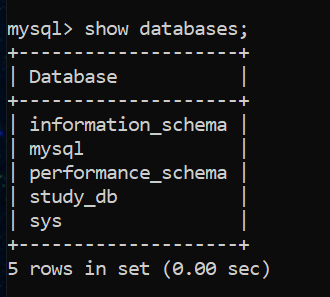

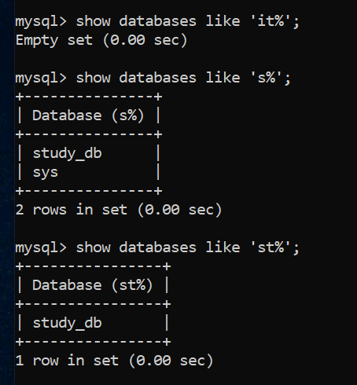

### 创建数据库

```mysql
/*方法一*/
// 创建一个名为 cmdDBTest 的数据库，并设置默认的字符集和排序规则
create database cmdDBTest default character set UTF8 default collate utf8_general_ci;
/*方法二*/
//创建一个名为 cmdDBTest2 的数据库，但只有在该数据库不存在时才会创建，同时设置该数据库的默认字符集为 UTF-8，默认排序规则为 utf8_general_ci
create database if not exists cmdDBTest2 default character set UTF8 default collate utf8_general_ci; 
```

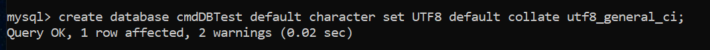


### 查询创建数据库的语句

```mysql
show create database test; // 没有test
show create database cmdDBTest2；
```

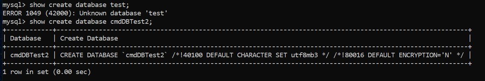

### 更改数据库选项字符集(生产环境有数据不能这样做，仅适用于新建的数据库)

```mysql
alter database study_db character set gbk;
alter database study_db character set utf8mb3;
```

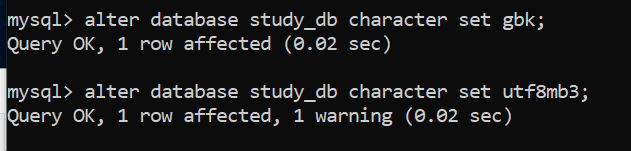

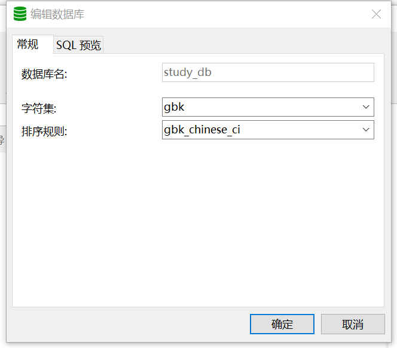

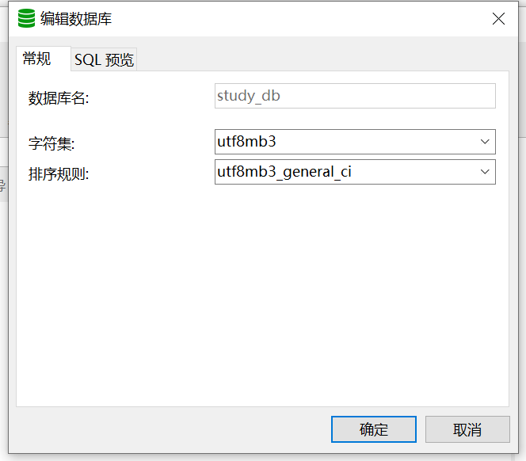

### 删除数据库

```mysql
/*方法一*/
// 如果数据库 cmddbTest2 存在，它将被删除。如果数据库不存在，MySQL 会抛出一个错误
drop database cmddbTest2;
/*方法二*/
//如果数据库 cmddbTest2 存在，则删除它；如果数据库不存在，则什么也不做
drop database if exists cmddbTest2;
```

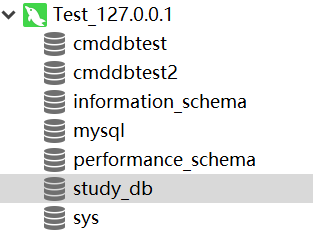

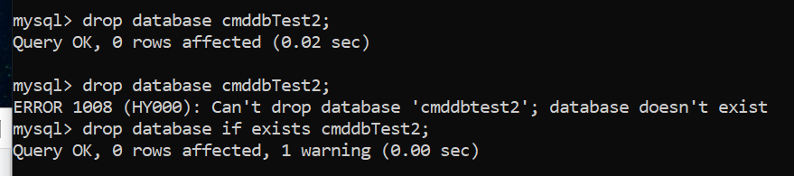

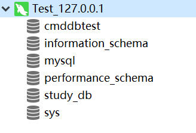

### 选择数据库

```mysql
use study_db;
```

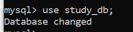

## **数据类型**

### 整数类型

- tinyint [(M)][unsigned][zerofill]
- smallint [(M)][unsigned][zerofill]
- mediumint [(M)][unsigned][zerofill]
- int [(M)][unsigned][zerofill]
- bigint [(M)][unsigned][zerofill]

参数说明：

- M：取值范围。
- unsigned：无符号，控制是否有正负数。
- zerofill：用来进行前导零填充，如tinyint的值为1，而其最长取值位数是3位，则填充后的结果会变成001。类型后面写了zerofill，默认就是unsigned无符号。

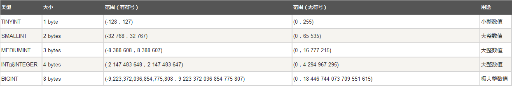

#### 无参数控制

```mysql
create table study01 (id01 tinyint,id02 int);
```

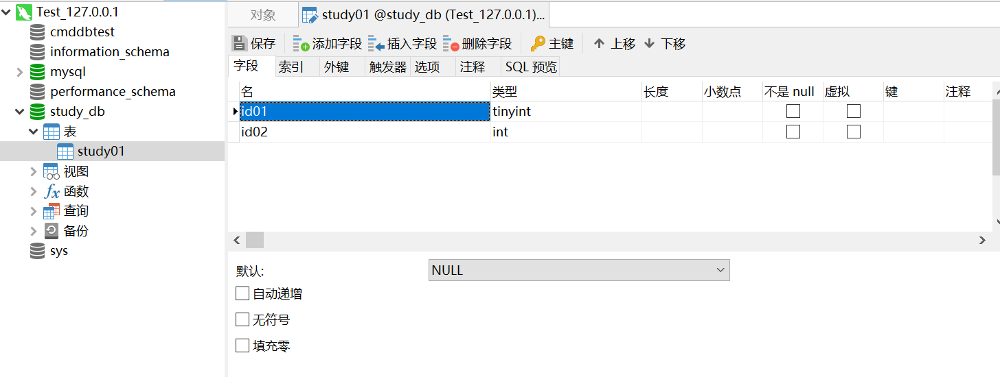

```mysql
desc study01; // 描述数据库中名为 study01 的表的结构
```

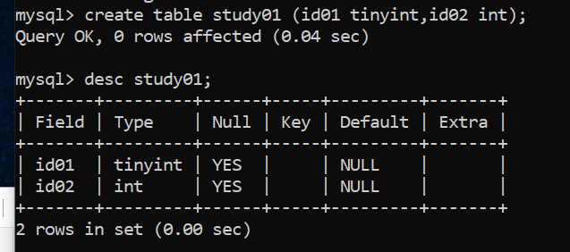

```mysql
insert into study01 (id01,id02) values (100,101);
```

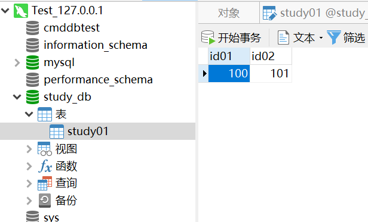

```
insert into study01 (id01,id02) values (-1,-2);
```

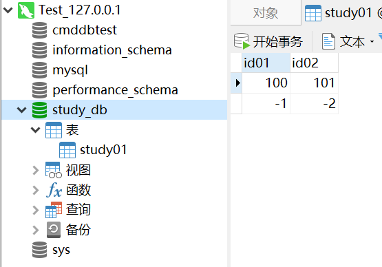

```mysql
//SQL 查询语句，用于从名为 study01 的数据库表中选择并返回所有列的所有数据
select * from study01;
```

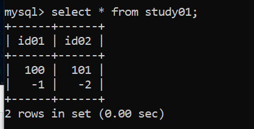

#### 有参数控制1

```mysql
create table study02 (id01 tinyint(3) unsigned zerofill,id02 int(3) unsigned zerofill);
```

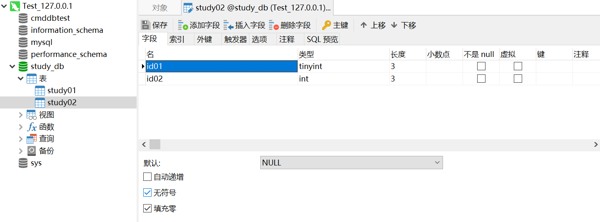

```
desc study02;
```

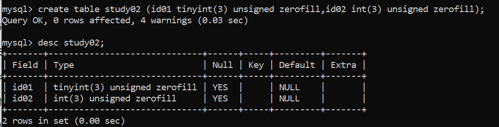

```mysql
insert into study02 (id01,id02) values (1,1);
insert into study02 (id01,id02) values (12,1234);
```

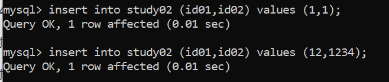

```mysql
select * from study02;
```

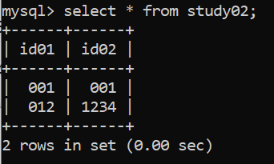

#### 有参数控制2

```mysql
create table study03 (id01 tinyint(4) unsigned,id02 int(4) zerofill);
```

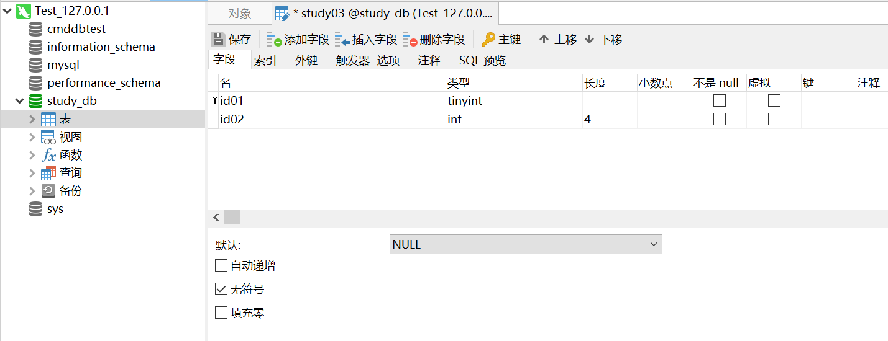


```mysql
insert into study01 (id01,id02) values (100,101);
insert into study01 (id01,id02) values (0,2);
select * from study01;
```

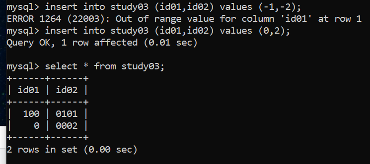

如果 `id01` 或 `id02` 列的数据类型是 **无符号（UNSIGNED）** 的整型类型（如 `INT UNSIGNED` 或 `BIGINT UNSIGNED`），则它们不允许存储负数

### 小数类型

- decimal (M,D)
- float (M,D)
- double (M,D)

参数说明：

- zerofill
- unsigned


#### 无参数控制

```mysql
create table studyf1 (f1 float,f2 double);
desc studyf1;
insert into studyf1 (f1,f2) values (-12.123,-1234.5678);
select * from studyf1;
```

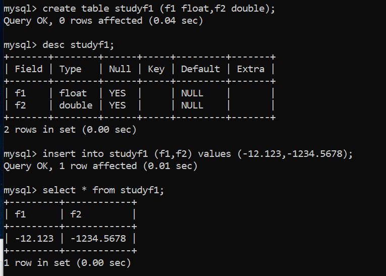

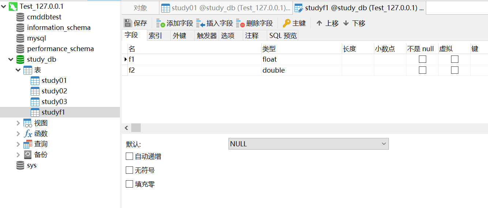

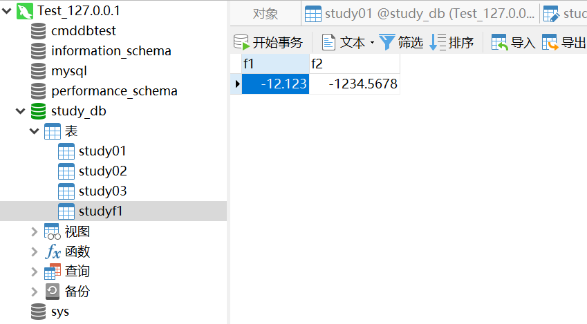

#### 有参数控制1

```mysql
create table studyf2 (f1 float(5,2),f2 double(6,3) zerofill);
desc studyf2;
insert into studyf2 (f1,f2) values (12.34,12.34);
insert into studyf2 (f1,f2) values (1.1,1.2);
insert into studyf2 (f1,f2) values (123.45,123.456);
insert into studyf2 (f1,f2) values (123.456,123.456);
/*科学计数法(E)，小数点移动几位。*/
insert into studyf2 (f1,f2) values (0.1234E2,0.123456E3);
/*插入多了，就会四舍五入。*/
insert into studyf2 (f1,f2) values (12.126,12.34);
select * from studyf2;
```

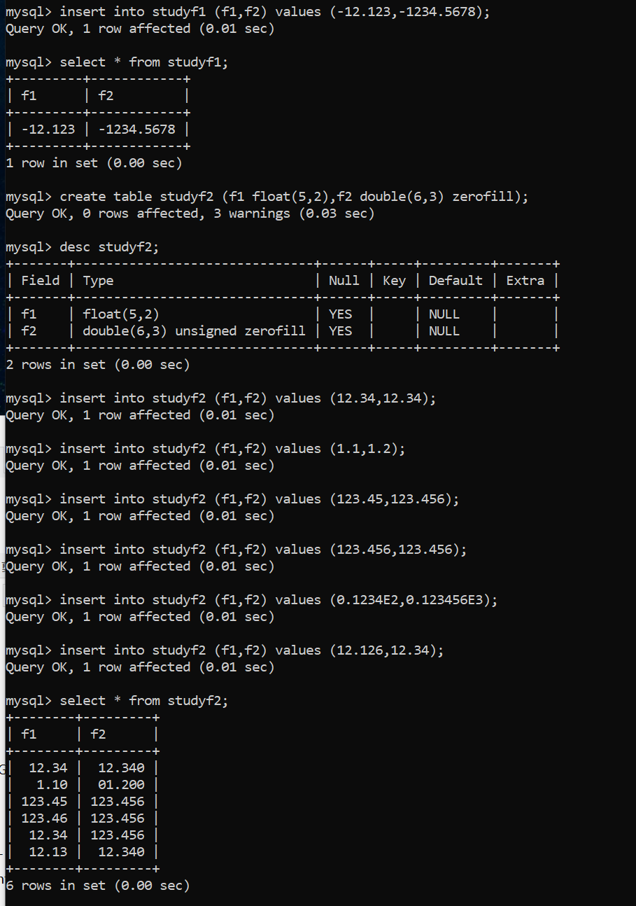

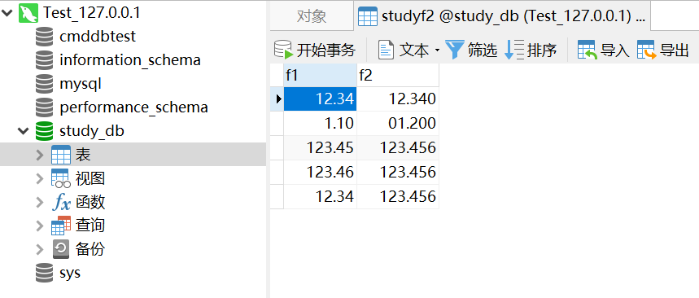

#### 有参数控制2

```mysql
create table studyf3 (f1 float(10,4) unsigned zerofill);
desc studyf3;
insert into studyf3 (f1) values (12.345);
insert into studyf3 (f1) values (12.3456);
insert into studyf3 (f1) values (12.34567);
select * from studyf3;
```

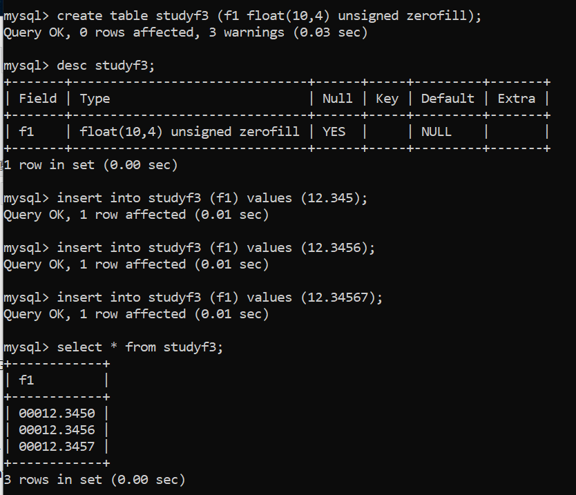

### 日期类型

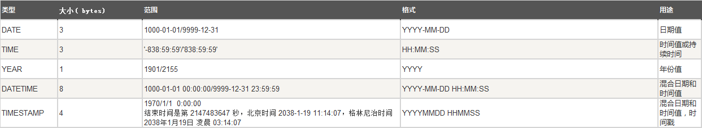

#### datetime(年月日时分秒)

```mysql
create table studyd1 (mydate datetime);
insert into studyd1 (mydate) values ('20200902230130');
insert into studyd1 (mydate) values (20200902230130);
insert into studyd1 (mydate) values ('2020-09-02 23:01:30');
insert into studyd1 (mydate) values (null);
select * from studyd1;
```

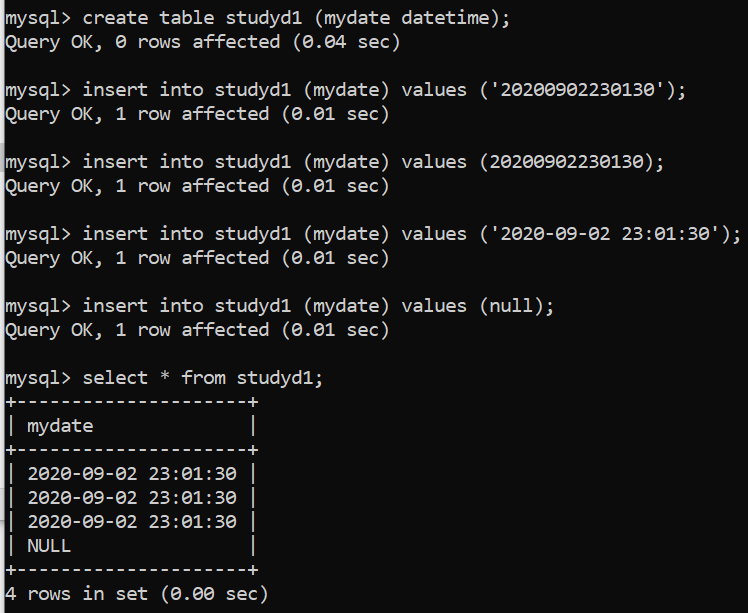

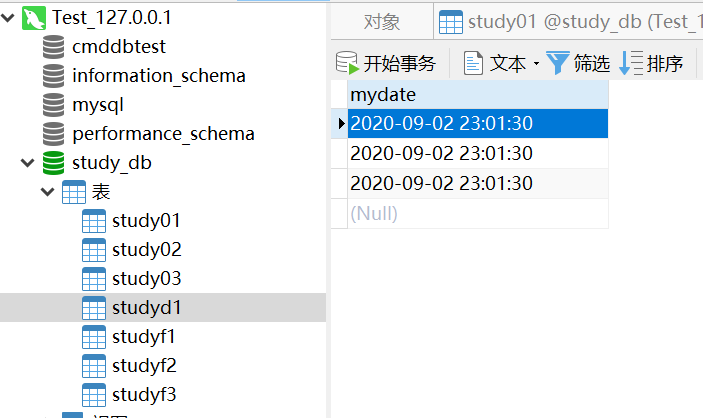

#### timestamp(年月日时分秒/整数)

```mysql
create table studyd2 (mytime timestamp);
insert into studyd2 (mytime) values ('20200902230130');
insert into studyd2 (mytime) values ('2020-09-02 23:01:30');
select * from studyd2;
/*+0 查看时间戳，显示整数。*/
select mytime+0 from studyd2;
```

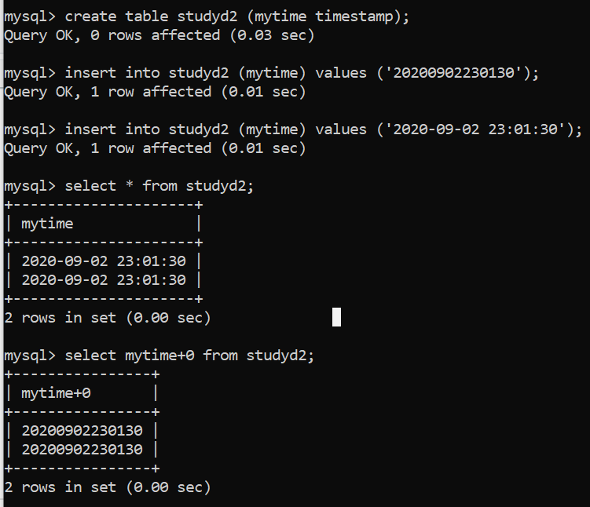

#### date(年月日)

```mysql
create table studyd3 (mydate date);
insert into studyd3 (mydate) values ('20200902');
insert into studyd3 (mydate) values ('2020-09-02');
select * from studyd3;
```

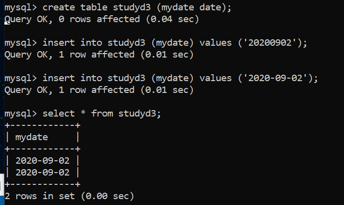

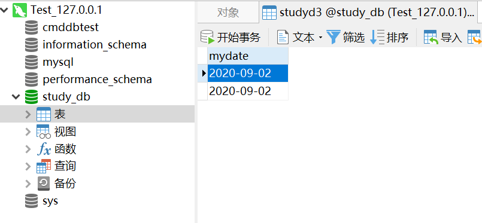

#### time(时分秒)

```mysql
create table studyd4 (mytime time);
insert into studyd4 (mytime) values ('10:10:10');
/*D HH:MM:SS，D代表天，最大可以是34天，代表过去多少时间。*/
insert into studyd4 (mytime) values ('5 10:10:10');
select * from studyd4;
```

#### year

```
create table studyd5 (myyear year);
insert into studyd5 (myyear) values ('2020');
insert into studyd5 (myyear) values ('2021');
select * from studyd5;
```

### 字符类型

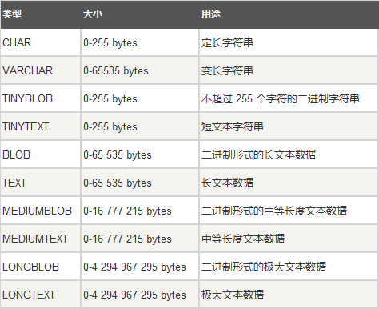

#### char(M)

M表示字符固定长度，最大为255字节

```mysql
create table studyz1 (mychar char(255));
insert into studyz1 (mychar) values ('YES');
insert into studyz1 (mychar) values ('NO');
insert into studyz1 (mychar) values ('Y ');
insert into studyz1 (mychar) values (' N');
select * from studyz1;
// 从 studyz1 表中查询 mychar 列的内容，并且使用 LENGTH 函数来计算 mychar 中每个字符串的长度
select mychar,length(mychar) `length` from studyz1;
```

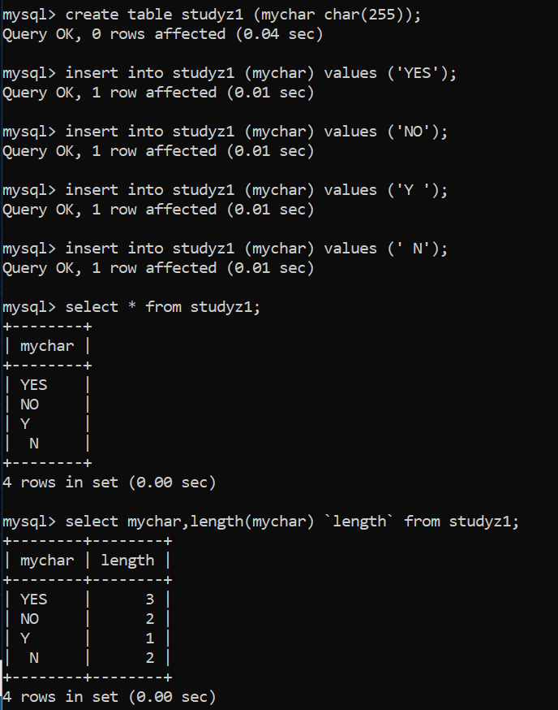

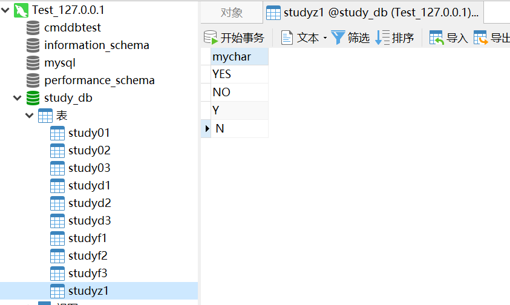

#### varchar(M)

M表示字符可变长度，最大65535字节，需要1-2字节来保存信息，超过255的长度就用2个字节来保存。

utf8：一个字符占用3个字节 65535/3=21845 -1 -2=21844/21843

gbk：一个字符占用2个字节 65535/2=32767 -1 -2=32766/32765

最大长度是受最大65535字节和所使用的字符集有关

```mysql
create table studyz2 (myvarchar varchar(21844));
insert into studyz2 (myvarchar) values ('YES');
insert into studyz2 (myvarchar) values ('NO');
insert into studyz2 (myvarchar) values ('Y ');
insert into studyz2 (myvarchar) values (' N');
select * from studyz2;
//从 studyz2 表中选择 myvarchar 列，并计算 myvarchar 列中每个字符串的长度，结果以 length 列的形式返回
select myvarchar,length(myvarchar) `length` from studyz2;
```

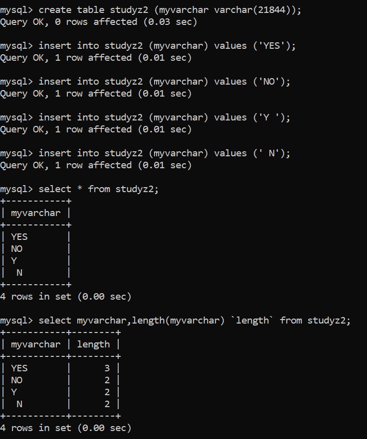

#### text

**text和blob区别：blob用来保存二进制数据，text保存字符数据。**

**text和char/varchar区别：text不需要指定长度。**

存储长度：1字节-4GB

```mysql
create table text1 (id int,name tinytext);
create table text2 (id int,name text);
create table text3 (id int,name mediumtext);
/*longtext：最大4GB，4字节开销。*/
create table text4 (id int,name longtext);
```

|    类型    | 说明                                                         |
| :--------: | :----------------------------------------------------------- |
|  tinytext  | 最大256 bytes，1字节开销，少于255个字符的，就比较好，比如：文章摘要 |
|    text    | 最大64k，相当于65535个字符，2字节开销，比如：文章正文        |
| mediumtext | 最大16MB，相当于16777215个字符，3字节开销，存储相对大的文本数据，比如书籍文本，白皮书 |
|  longtext  | 最大4GB，4字节开销                                           |

#### blob

```mysql
create table blob1 (id int,name tinyblob);
create table blob2 (id int,name blob);
create table blob3 (id int,name mediumblob);
create table blob4 (id int,name longblob);
```

|    类型    | 说明          |
| :--------: | :------------ |
|  tinyblob  | 最大256 bytes |
|    blob    | 最大64k       |
| mediumblob | 最大16MB      |
|  longblob  | 最大4GB       |

#### enum相于单项选择题

最多65535个枚举项，2字节开销，相于单项选择题。

```mysql
create table studye1 (myenum enum('Y','N'));
insert into studye1 (myenum) values ('Y');
insert into studye1 (myenum) values ('N');
insert into studye1 (myenum) values ('1');
insert into studye1 (myenum) values ('2');
select * from studye1;
select myenum+0 from studye1;
```

#### set相当于多项选择题。

```mysql
create table studys1 (myset set('A','B','C','D'));
insert into studys1 values ('A');
insert into studys1 values ('A,B');
insert into studys1 values ('C');
insert into studys1 values ('C,D');
select * from studys1;
```

## **表的创建及管理**

### 创建表

需要信息：表名，表字段名，表字段的定义

create table table_name 列定义 选项;

create table table_name like old_table_name; --like:包括旧表的结构+信息+索引

create table table_name select * from old_table_name; --包括旧表的结构+信息

```mysql
create table studyt1
(
    id int(20) unsigned auto_increment not null,
    name varchar(20) not null,
    jobdate date,
    primary key (id)
) engine=innodb default charset=utf8;

show create table studyt1;
```

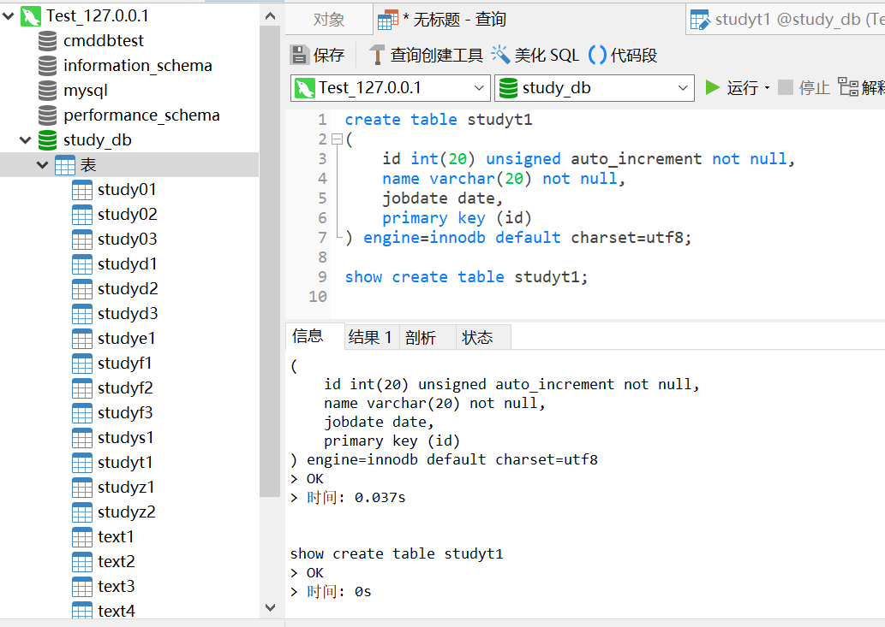

### 查询表

```mysql
//列出当前选定数据库中的所有表
show tables;
```

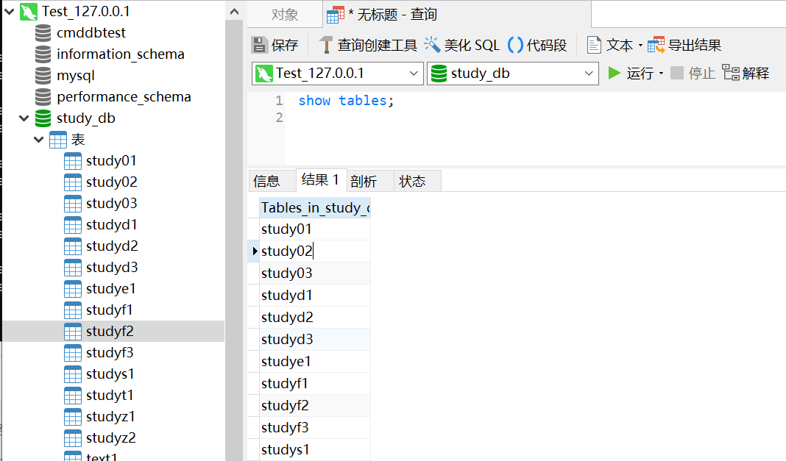

```mysql
//列出名为 study_db 的数据库中的所有表
show tables from study_db;
```

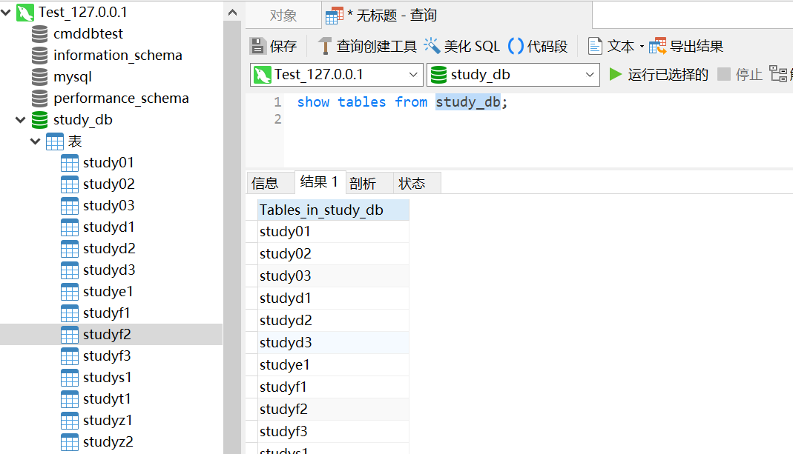

```mysql
//列出当前选定数据库中所有以 'te' 开头的表名
show tables like 'te%';
```


```mysql
//列出 study_db 数据库中所有以 'te' 开头的表名
show tables from study_db like 'te%';
```

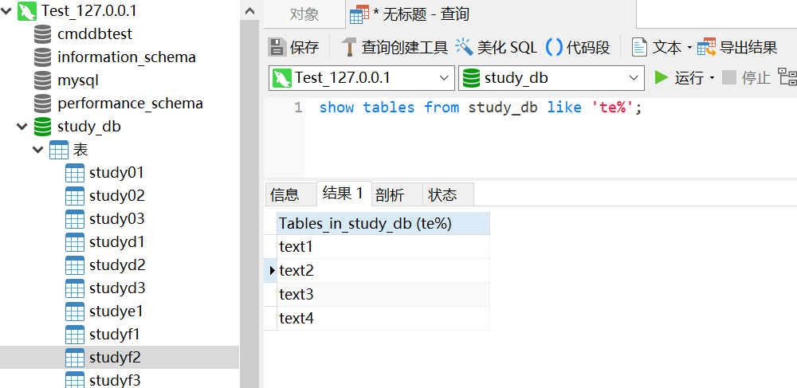

### 查看表内容

```mysql
select * from study01;
```

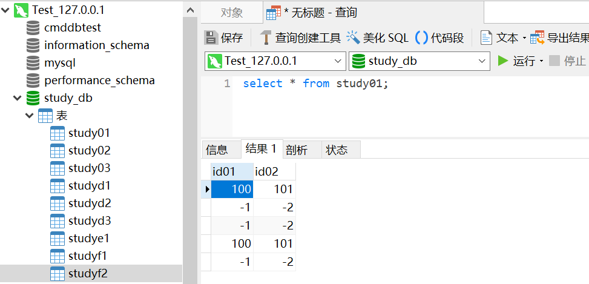

```mysql
//从名为 test 的数据库中的 study01 表中选择所有列的数据
select * from study_db.study01;
```

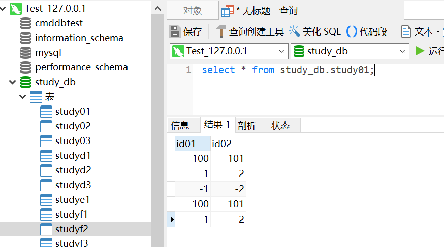

```mysql
//从名为 study_db 的数据库中的 study01 表中选择 id01 和 id02 这两列的数据，并限制返回的结果为最多 2 行
select id01,id02 from study_db.study01 limit 2;
```

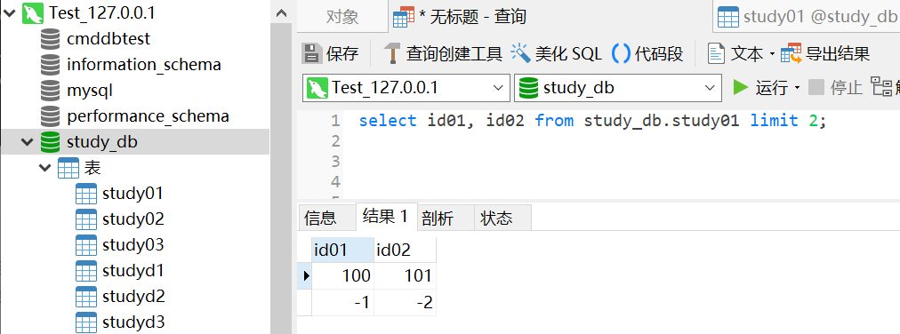

### 表的增删改查

#### 查数据库是否是自动commit

```mysql
//用于检查 MySQL 数据库中自动提交设置的有用命令
show variables like '%autocommit%';
```

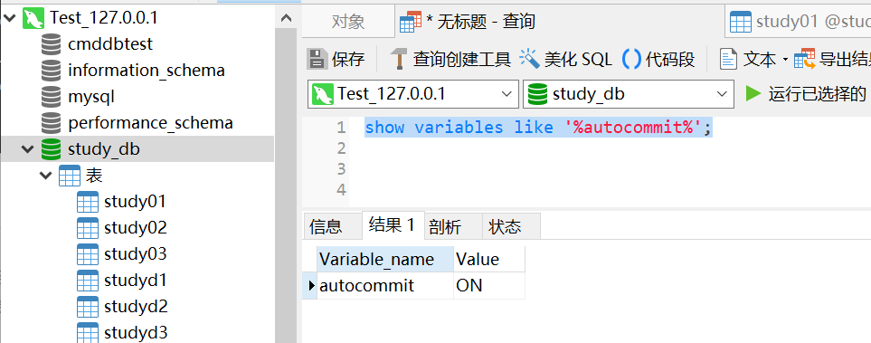

表示当前会话的自动提交功能是开启的

#### 测试表和数据

```mysql
create table study11 (id int(3),name varchar(12),sex varchar(6));
create table study12 (id int(3),name varchar(12),age int(5));

insert into study11 (id,name,sex) values 
(1,'study01','男'),
(2,'study02','男'),
(3,'study03','女'),
(4,'study04','女'),
(5,'study05','女');

insert into study12 (id,name,age) values 
(1,'study01',20),
(2,'study02',21),
(3,'study03',18),
(4,'study04',19),
(5,'study05',28);
```

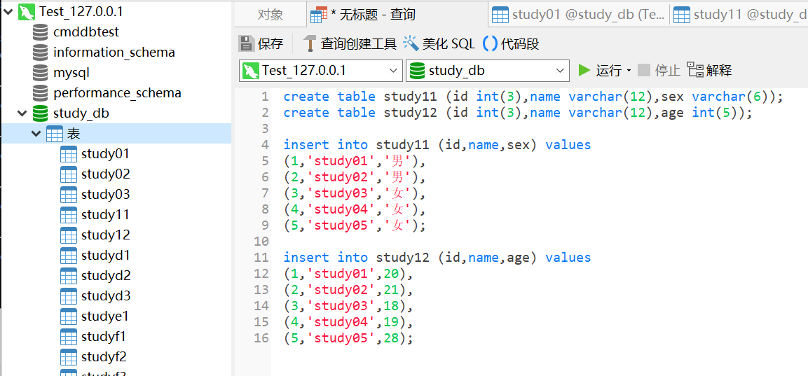

#### insert

语法：insert into table_name (表字段) values (值列表);

```mysql
/*方法1*/
insert into study11 (id,name,sex) values (6,'study06','男');/*方法2*/
insert into study11 values (7,'study07','男');
/*方法3*/
insert into study11 set id=8,name='study06',sex='男';
/*方法4*/
insert into study1 values (1,'study01',now(),20);/*方法5*/
insert into study1 values (2,'study02',default,20);
/*方法6*/
create table study13 select * from study11; // 创建一个新表 study13，并将 study11 表中的所有数据复制到 study13 中
truncate table study13; // 清空 study13 表中的所有数据
insert into study13 select * from study11; //  将 study11 表中的所有数据再次插入到 study13 表中
```

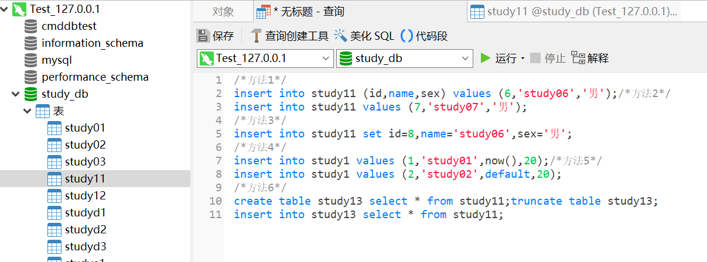

#### delete

语法：delete from 表名 [where 条件] [order by] [limit row_count];

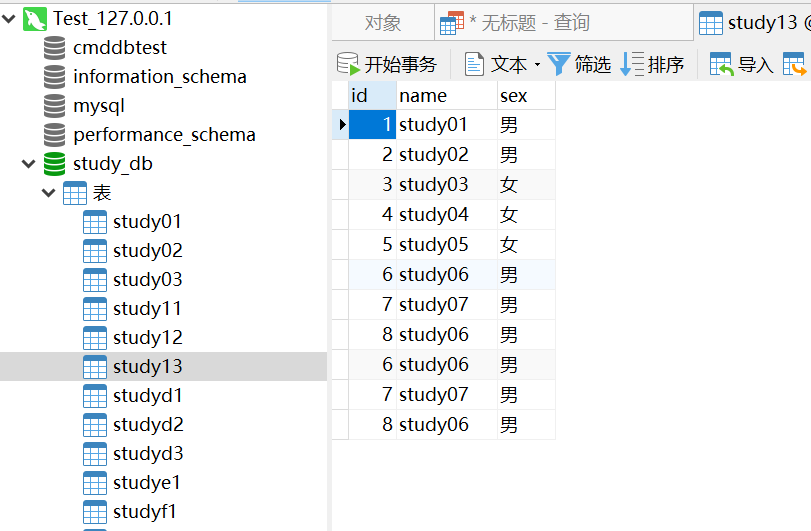

```mysql
delete from study13 where id=1;// 从 study13 表中删除 id 列值为 1 的行
```

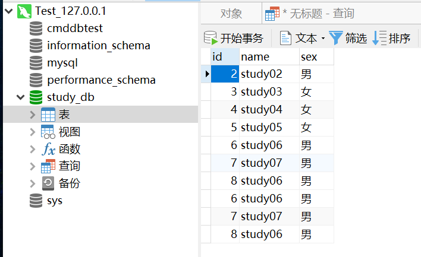

```mysql
delete from study13 limit 2;// 用于从 study13 表中删除最多 2 行数据
```

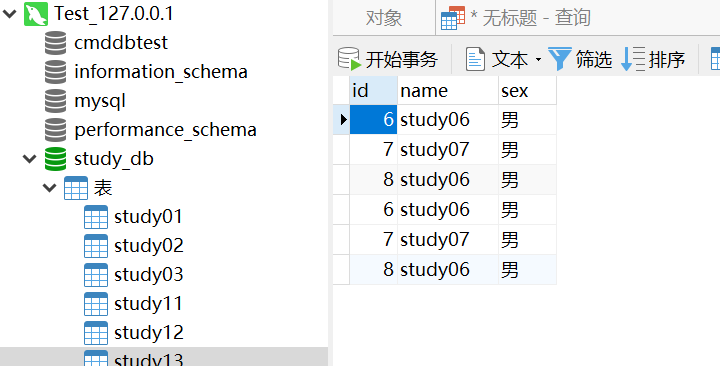

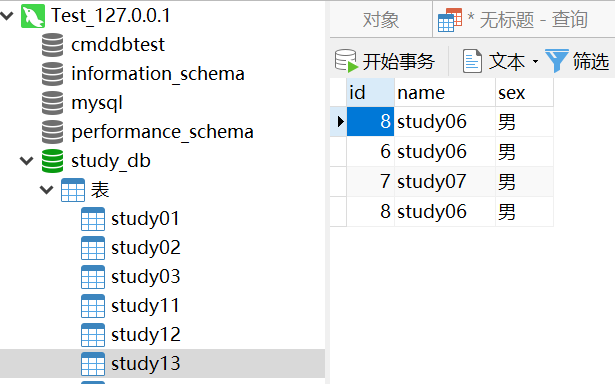

#### update

语法：update 表名 set 列名=值 where 条件;

```mysql
update study13 set name='study11',sex='女' where id=1;
```

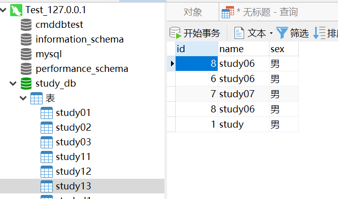

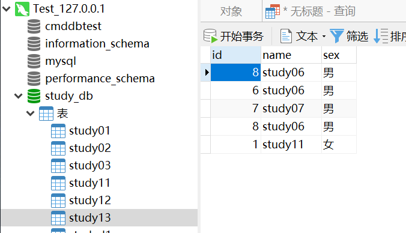

#### select

**语法：select 字段/表名 from 表名/视图名 where 查询条件;**

查询条件：

- where 条件
- group by 分组
- having 分组后再聚合
- limit 限制多少行显示
- order by [asc|desc] 排序，升|降

##### 列连接

```mysql
//从 study11 表中选择数据的 SQL 查询语句。它不仅返回 name 列的值，还通过连接 name 和 sex 列生成一个新的列，便于在结果中显示姓名和性别的组合
select name,concat(name,'-',sex) as '姓名+性别' from study11;
```

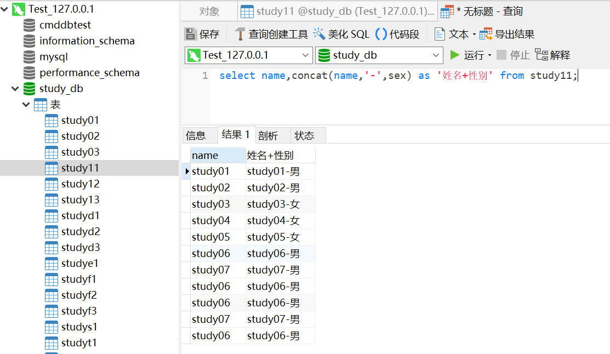

##### 别名 as/也可以省略

```mysql
//条件是 study11 表和 study12 表中的 name 列相匹配。这种查询常用于查找两个表之间的关联数据
select a.* from study11 a,study12 b where a.name=b.name;
```

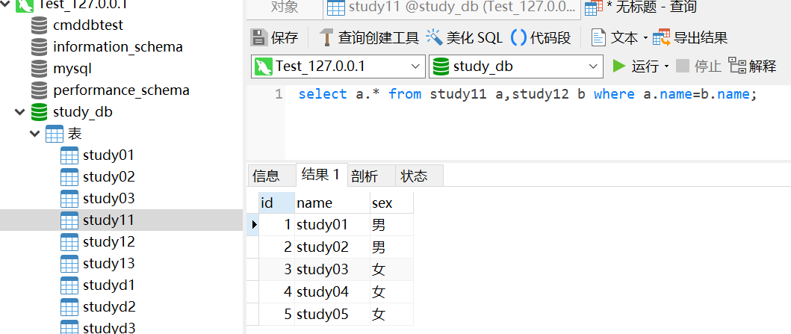

##### 虚拟表dual

```c#
//从虚拟表 dual 中选择当前的日期和时间。由于 dual 表只有一行一列，因此查询结果将只返回当前的日期和时间
select now() from dual;
```


##### SQL语句注释方式

- 语句前注释：#
- \#select now() from dual;
- 语句后注释：--
  select now() from dual; --查当前系统时间
- 多行注释：/**/

```mysql
/*select now() from dual;*/
```

##### 常用的运算符

- =：等于
- \>：大于
- <：小于
- \>=：大于等于
- <=：小于等于
- <>：不等于
- !=：不等于
- is null：为null
- is not null：不为null
- [not]like：模糊查询
- [not]between and：在什么范围内
- [not]in：在什么范围值内

```mysql
select * from study12 where age=20;
select * from study12 where age<>20;
select * from study12 where age>20;
select * from study12 where age>=20;
select * from study12 where age<20;
select * from study12 where age<=20;
//从 study12 表中选择所有列的数据，前提是 age 列的值在 18 到 20 之间（包括 18 和 20）
select * from study12 where age between 18 and 20;
select * from study12 where age not between 18 and 20;
select * from study12 where age>=18 and age<=20;
select * from study12 where age>=18 && age<=20;
//从 study12 表中选择所有列的数据，前提是 age 列的值为 18、19 或 28
select * from study12 where age in (18,19,28);
select * from study12 where age not in (18,19,28);
select * from study12 where name like 'study%';
//从 study12 表中选择所有列的数据，前提是 name 列的值不包含 005 字符串
select * from study12 where name not like '%005%';
```

##### 逻辑运算

- 非：not
- 与：and &&
- 或：or
- 异或：xor

```mysql
在 SQL 中，使用普通的等于运算符 = 进行 NULL 值比较时，结果会返回 NULL，而不是 TRUE 或 FALSE。
例如，NULL = NULL 的结果是 NULL，而 NULL <=> NULL 的结果是 TRUE
select null is not not null,null is null;
select null<=>null,10<=>null;
```

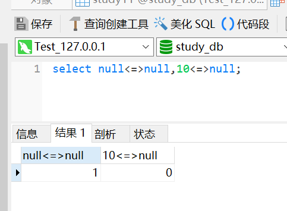

##### 组合

```mysql
select * from study12 where name='study01' and age=20;
select * from study12 where name='study01' or age=21;
```

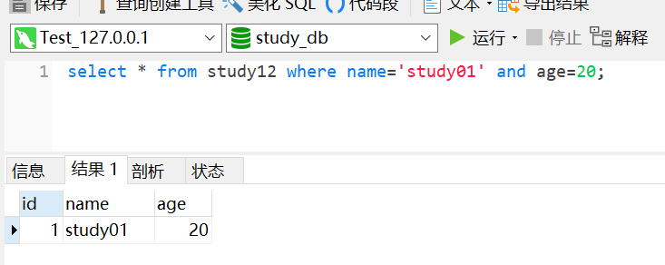

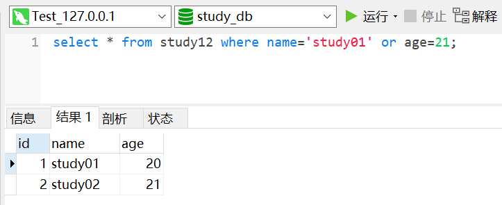

##### like

从 `study12` 表中选择所有列的数据，前提是 `name` 列的值以 `study` 开头

```mysql
select * from study12 where name like 'study%';
```

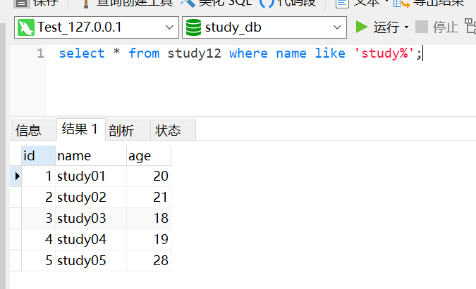

##### 查询分组与排序

group by 分组

group by 列 {asc升序|desc降序},{with rollup} 组内聚合计算

```mysql
//是一条用于从 study12 表中选择数据的 SQL 查询语句，按 name 列的前 4 个字符进行分组，并将相同组的 name 值连接成一个字符串
select left(name,4),group_concat(name) name from study12 group by left(name,4);
```

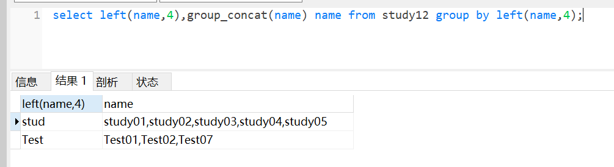

##### limit:限制返回的行数

```mysql
//从 study12 表中选择所有列的数据，按 age 列降序排序，并只返回年龄最大的那一行
select * from study12 order by age desc limit 1;
```

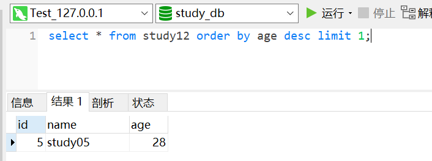

##### distinct:去除重复记录

```mysql
//从 study12 表中选择 name 列的前 4 个字符，并返回唯一的结果
select distinct left(name,4) name from study12;
```

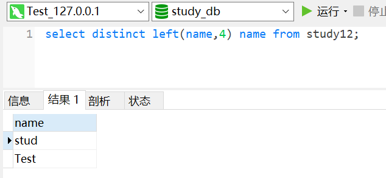

##### union:有重并集,把多个结果组合不去重

```mysql
//从 study11 表和 study12 表中分别选择 name 列的值，并将这两个结果集合并在一起，返回所有的 name 值，包括重复的值
select name from study11 union all select name from study12;
```

> 使用 `UNION` 操作符时，两个表的列数和数据类型必须匹配。根据你提供的信息，表1（包含 `id`、`name`、`sex`）和表2（包含 `id`、`name`、`age`）的列数和数据类型不完全相同，因此不能直接使用 `UNION` 来合并这两个表

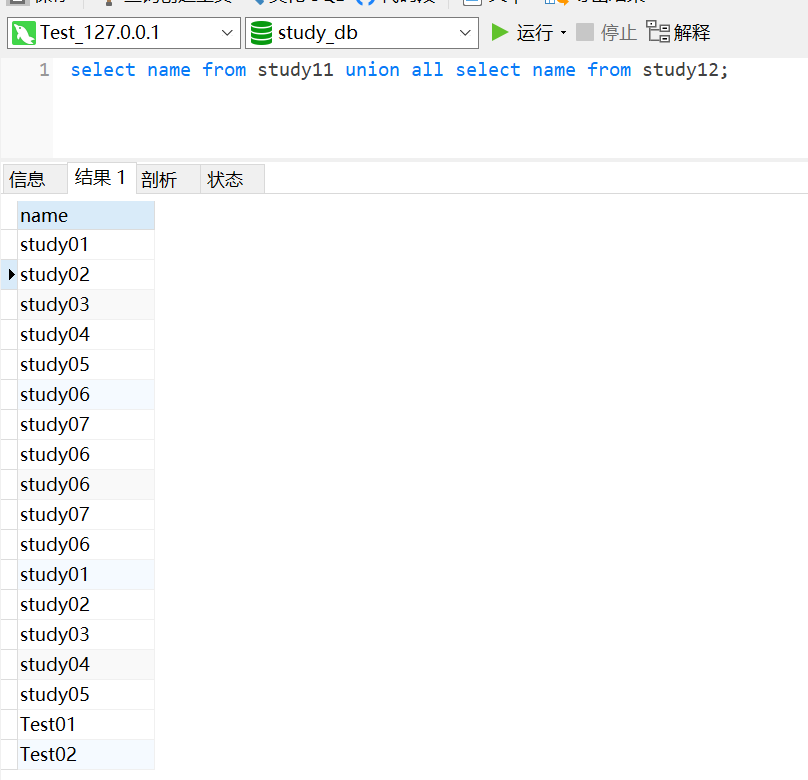

##### unionall:有重并集,把多个结果组合不去重

```mysql
//从 study11 表和 study12 表中分别选择 name 列的值，并将这两个结果集合并在一起，返回所有的 name 值，包括重复的值
select name from study11 union all select name from study12;
```

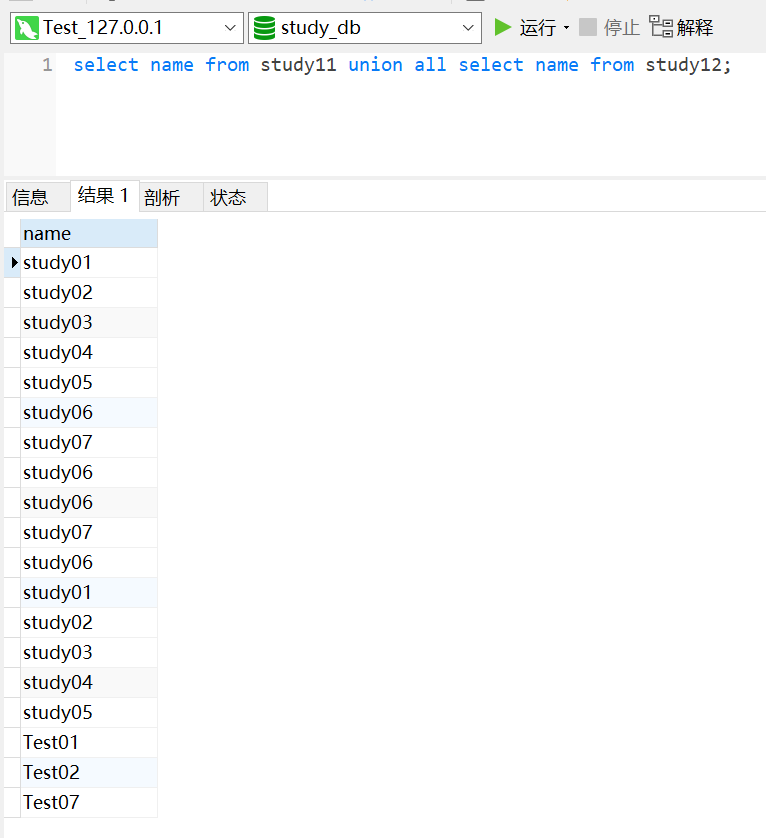

##### for update:会锁表(生产环境不要轻易用)

```mysql
//从 study11 表中选择所有行，并对这些行进行锁定，以便在当前事务中进行更新或其他操作
select * from study11 for update;
```

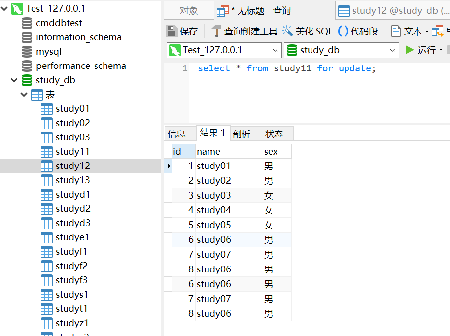

## **常用函数**

### 字符串函数

#### concat(str1,str2,...)：拼接

作用：将传入的字符连接成一个字符串，任何字符与null进行连接结果都是null。

```mysql
SELECT CONCAT(`name`,'-',sex) FROM study11;
```

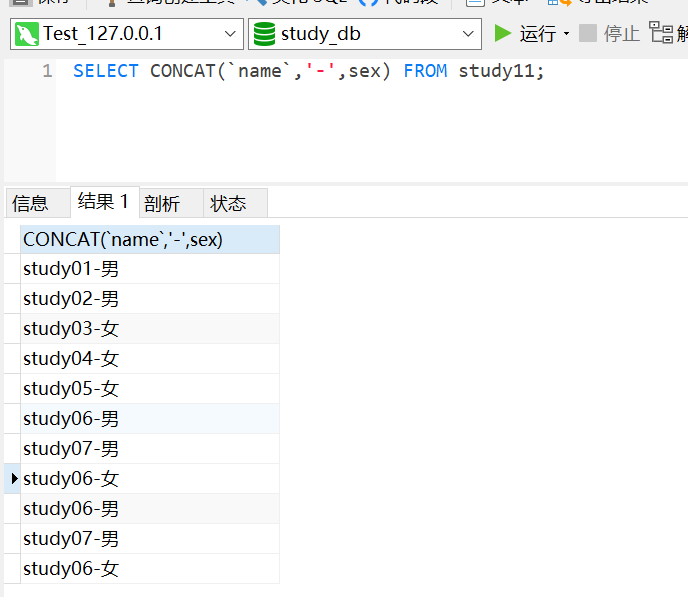

#### insert(str,pos,len,newstr)：插入

作用：将字符串str从pos位置开始len个字符长的子串，替换为指定的字符newstr。

```mysql
SELECT INSERT('ABCDEFG',2,3,'XXX');
```

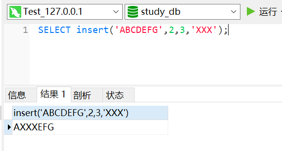

> 说明：SQL Server中对应的函数是STUFF。

```mysql
SELECT STUFF('ABCDEFG',2,3,'XXX')
```

#### LOWER(str)：小写

作用：将字符串转成小写。

```mysql
SELECT LOWER('ABC');
```


#### UPPER(str)：大写

作用：将字符串转成大写。

```mysql
SELECT UPPER('abc');
```


#### LEFT(str,len)：左边的len个字符

作用：返回字符串str最左边的len个字符。

```mysql
SELECT LEFT('abc',2);
```

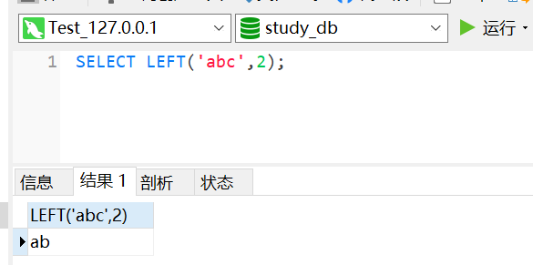

#### RIGHT(str,len)：右边的len个字符

作用：返回字符串str最右边的len个字符。

```mysql
SELECT RIGHT('abc',2);
```

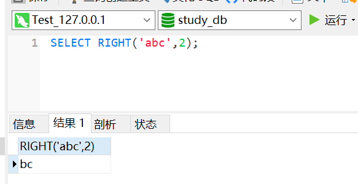

#### LPAD(str,len,padstr):在列的左边粘贴字符

作用：用字符串padstr对str最左边进行填充，直到总长度达到len个字符为止。

```mysql
SELECT LPAD('abc',10,'def');
```

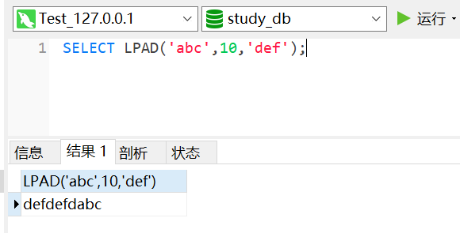

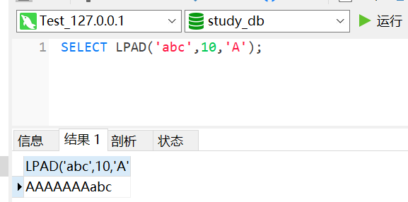

> 说明：SQL Server中没有对应的函数。

#### RPAD(str,len,padstr):在列的右边粘贴字符

作用：用字符串padstr对str最右边进行填充，直到总长度达到len个字符为止。

```mysql
SELECT RPAD('abc',10,'def')；
```

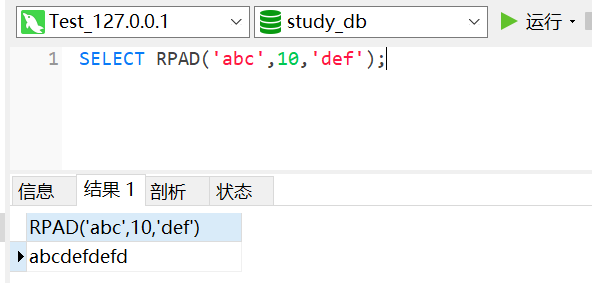

>  说明：SQL Server中没有对应的函数。

#### LTRIM(str):去除字符串当中最左侧的空格

作用：去除字符串当中最左侧的空格。

```mysql
SELECT LTRIM('   abc');
```

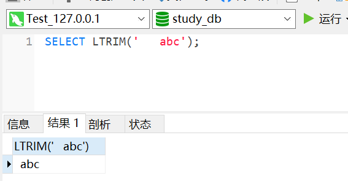

#### RTRIM(str):去除字符串当中最右侧的空格

```mysql
SELECT RTRIM('ab c   ');
```

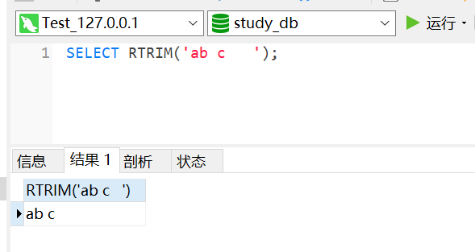

#### TRIM([remstr FROM] str):去除字符

完整格式：TRIM([{BOTH | LEADING | TRAILING} [remstr] FROM] str)

作用：返回字符串str，其中所有remstr前缀和/或后缀都已被去除。若分类符BOTH、LEADIN或TRAILING中没有一个是给定的，则假设为BOTH。remstr为可选项，在未指定情况下，可去除空格。

##### 去除两侧空格

```mysql
SELECT TRIM('   a b c   ');
```

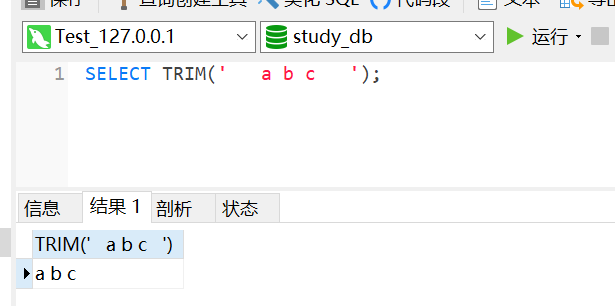

##### 去除两侧'x'字符

```mysql
SELECT TRIM(BOTH 'x' FROM 'xxxbxaxrxxx');
```

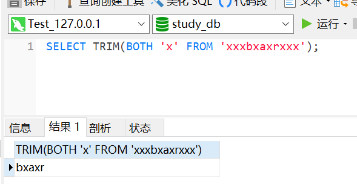

##### 去除左侧'x'字符

```mysql
SELECT TRIM(LEADING 'x' FROM 'xxxbarxxx');
```

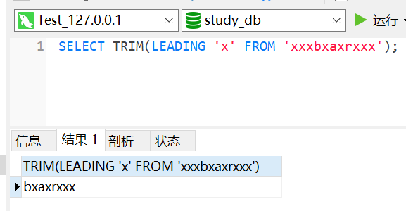

##### 去除右侧'x'字符

```mysql
SELECT TRIM(TRAILING 'x' FROM 'xxxbarxxx');
```

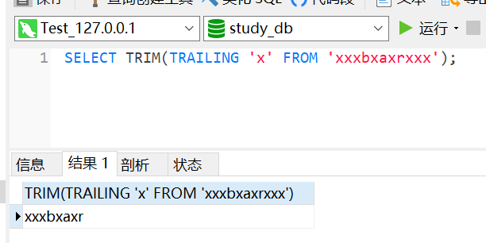

##### 去除右侧'xyz'字符串

```mysql
SELECT TRIM(TRAILING 'xyz' FROM 'barxyzxyz');
```


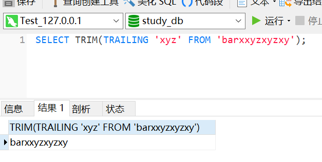

> 说明：SQL Server中没有对应的函数。

#### REPEAT(str,count):返回str重复count次的结果

```mysql
SELECT REPEAT('abc',3);
```

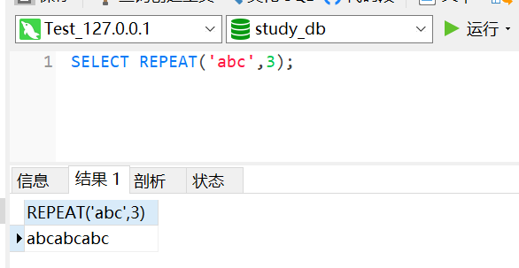

>  说明：SQL Server中没有对应的函数

#### REPLACE(str,from_str,to_str):用字符串to_str替换字符串str中所有出现的字符串from_str

```mysql
SELECT REPLACE('mysql','my','hello my');
```

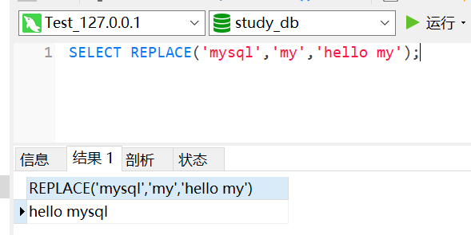

#### SUBSTRING(str FROM pos FOR len):返回字符串str中第pos位置起len个字符长度的字符

```mysql
SELECT SUBSTRING('abc',2,2);
```

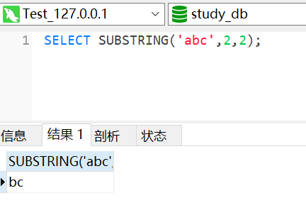

### 数值函数

#### ABS(X)：返回X的绝对值

```mysql
SELECT ABS(-1);
```

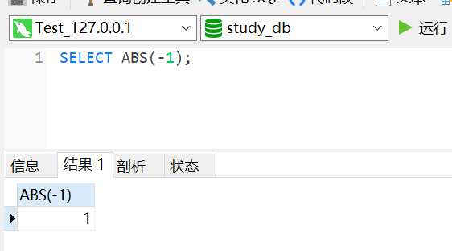

#### CEILING(X)

作用：小数不为零部分向上取整，即向上取最近的整数。

```mysql
SELECT CEILING(1.1);
```

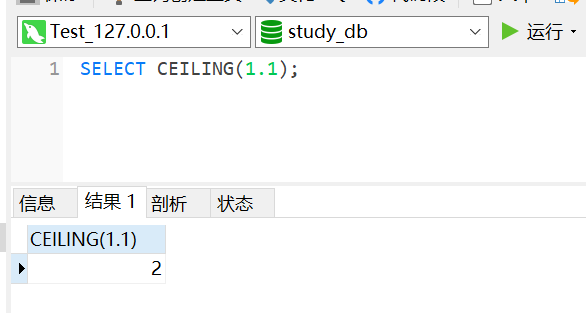

#### FLOOR(X)

作用：小数不为零部分向下取整，即向下取最近的整数。

```
SELECT FLOOR(2.3);
```

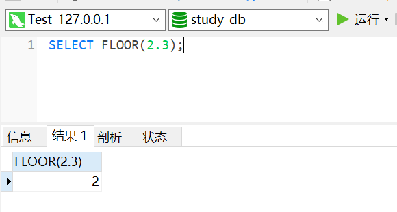

#### MOD(N,M):返回N/M的模，即求余

```
SELECT MOD(5,2);
SELECT 5%2;
```

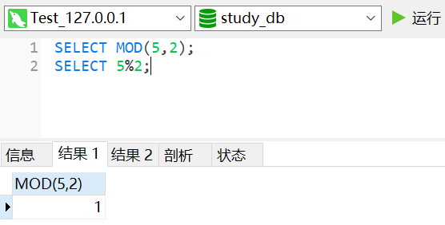

> 说明：SQL Server中没有对应的函数，只能通过%求余。

```mysql
SELECT 5%2
```

#### RAND()

作用：返回0-1内容的随机值。

```mysql
SELECT CEILING(RAND()*10);
```

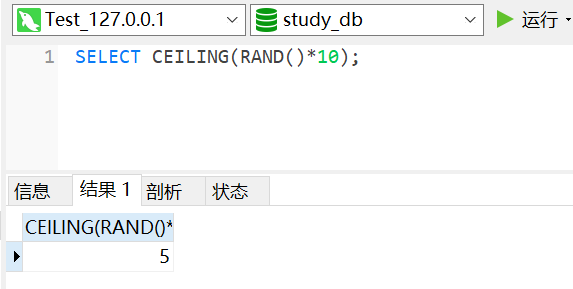

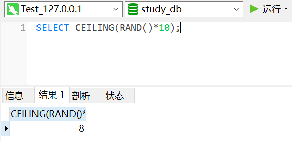

### 日期和时间函数

#### CURDATE()

作用：返回当前日期，只包含年月日。

```mysql
SELECT CURDATE();
```

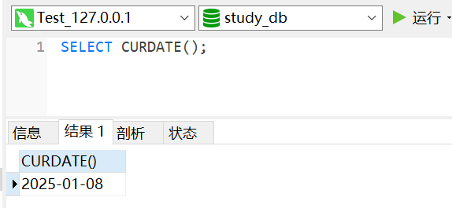

> 说明：SQL Server中没有对应的函数。

#### CURTIME()

作用：返回当前时间，只包含时分秒。

```mysql
SELECT CURTIME();
```

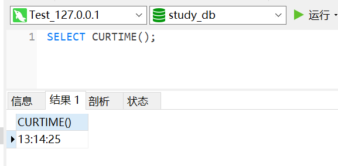

说明：SQL Server中没有对应的函数。

#### NOW()

作用：返回当前日期和时间，年月日时分秒都包含。

```mysql
SELECT NOW();
```

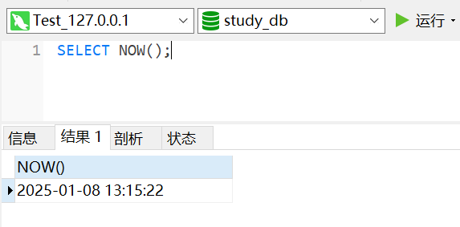

> 说明：SQL Server中对应的函数是GETDATE。

```mysql
SELECT GETDATE()
```

#### UNIX_TIMESTAMP()

```mysql
//是一条用于获取当前 Unix 时间戳的 SQL 查询语句，返回自 1970 年 1 月 1 日以来经过的秒数，常用于时间记录和计算
SELECT UNIX_TIMESTAMP();
```

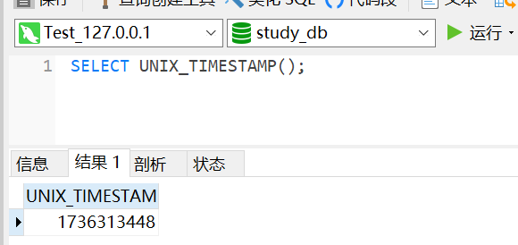

#### FROM_UNIXTIME(unix_timestamp)

```mysql
//用于将给定的 Unix 时间戳转换为可读的日期和时间格式
SELECT FROM_UNIXTIME(1599560172);
```

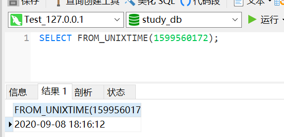

> 说明：SQL Server中没有对应的函数

#### WEEK(date):返回当前是一年中的第几周

```mysql
SELECT WEEK(NOW());
```

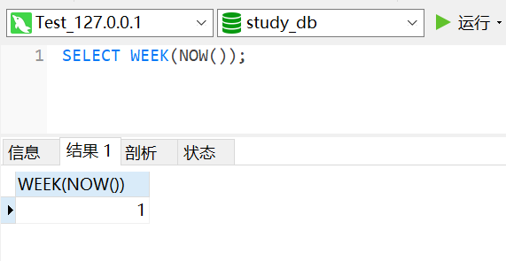

> 说明：SQL Server中对应的函数是DATEPART

```mysql
SELECT DATEPART(WEEK,GETDATE())
```

#### YEAR(date):返回所给日期是哪一年

```
SELECT YEAR(NOW());
```

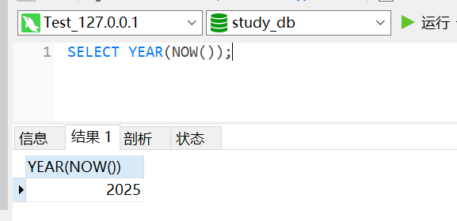

#### HOUR(time):返回当前时间的小时

```mysql
SELECT HOUR(NOW());
```

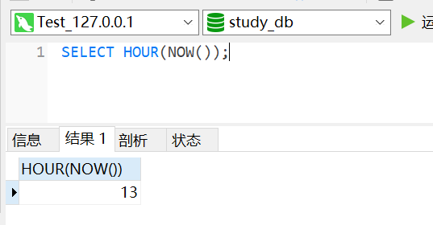

> 说明：SQL Server中对应的函数是DATEPART。

```mysql
SELECT DATEPART(HOUR,GETDATE())
```

#### MINUTE(time):返回当前时间的分钟

```mysql
SELECT MINUTE(NOW());
```

> 说明：SQL Server中对应的函数是DATEPART。

```mysql
SELECT DATEPART(MINUTE,GETDATE())
```

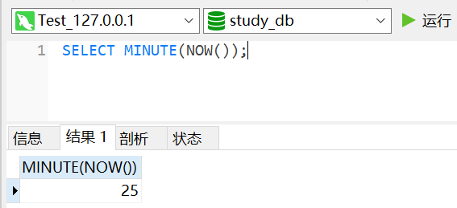

#### DATE_FORMAT(date,format)

作用：用于以不同的格式显示日期/时间数据。

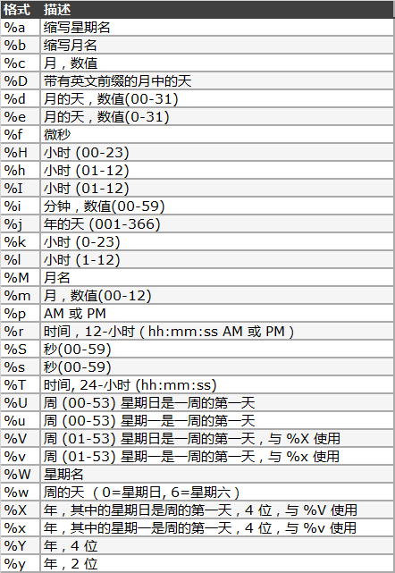

```mysql
SELECT DATE_FORMAT(NOW(),'%Y-%m-%d');
```

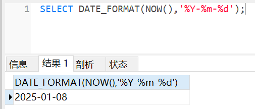

```mysql
SELECT DATE_FORMAT(NOW(),'%Y%m%d');
```

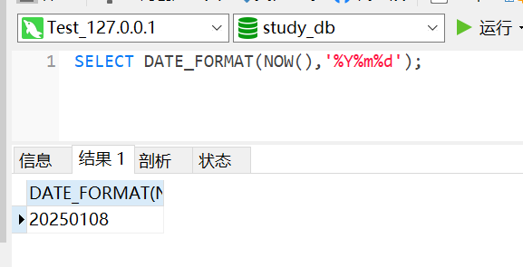

```mysql
SELECT DATE_FORMAT(NOW(),'%y%m%d');
```

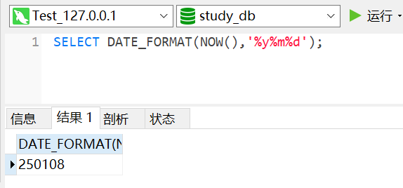

> 说明：SQL Server中对应的函数是CONVERT。

```mysql
SELECT CONVERT(VARCHAR(10),GETDATE(),120)
SELECT CONVERT(VARCHAR(10),GETDATE(),112)
SELECT CONVERT(VARCHAR(10),GETDATE(),12)
```

#### DATE_ADD(date,INTERVAL expr unit)

作用：向日期添加指定的时间间隔。

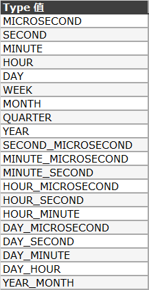

```mysql
SELECT DATE_ADD(NOW(),INTERVAL 3 DAY);
```

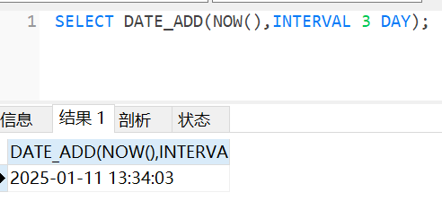

```mysql
SELECT DATE_ADD(NOW(),INTERVAL 1 MONTH);
```

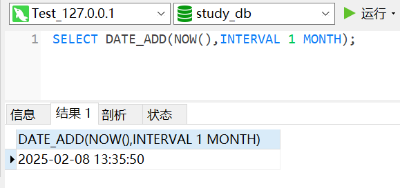

> 说明：SQL Server中对应的函数是DATEADD。

```mysql
SELECT DATEADD(DAY,3,GETDATE())
SELECT DATEADD(MONTH,1,GETDATE())
```

#### DATEDIFF(expr1,expr2)：返回两个日期之间的天数

```mysql
SELECT DATEDIFF('2020-06-06',NOW());
```

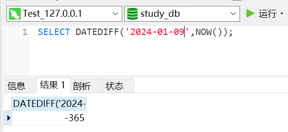

说明：SQL Server中对应的函数是DATEDIFF，不过结果是相反的。

```mysql
SELECT DATEDIFF(DAY,'2020-06-06',GETDATE())
```

### 流程函数

#### IF(expr1,expr2,expr3)

作用：如果expr1是真，返回expr2，否则返回expr3。

```mysql
SELECT IF(2>3,TRUE,FALSE);
```


> 说明：SQL Server中对应的函数是IIF。

```mysql
SELECT IIF(2>3,1,0)
```

#### IFNULL(expr1,expr2)

作用：如果expr1不为空，返回expr1，否则返回expr2。

```mysql
SELECT IFNULL('abc','def');
```


```mysql
SELECT IFNULL(NULL,'def');
```

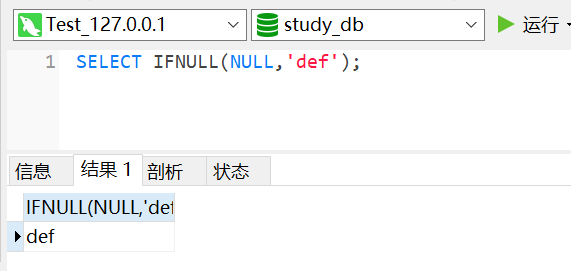

> 说明：SQL Server中对应的函数是ISNULL。

```mysql
SELECT ISNULL('abc','def')
SELECT ISNULL(NULL,'def')
```

#### CASE WHEN THEN END

作用：查询满足多种条件的情况。

```mysql
/*写法一*/
#用户变量，需使用@符号，也可以定义为SELECT @sex:='male';
SET @sex='male';
SELECT CASE @sex
    WHEN 'male' THEN
        '男'
    ELSE
        '女'
END AS '性别';

/*写法二*/
SET @score=90;
SELECT 
    CASE 
        WHEN @score BETWEEN 90 AND 100 THEN 'A+'
        WHEN @score BETWEEN 80 AND 89 THEN 'A'
        WHEN @score BETWEEN 60 AND 79 THEN 'B'
        ELSE 'C'
    END AS '评级';
```

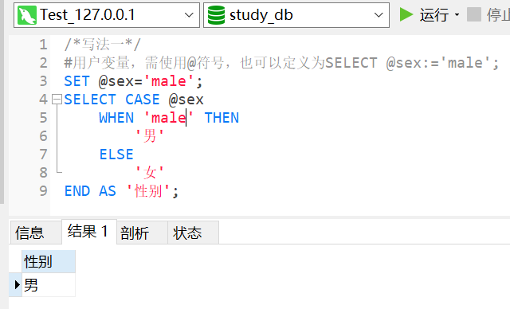

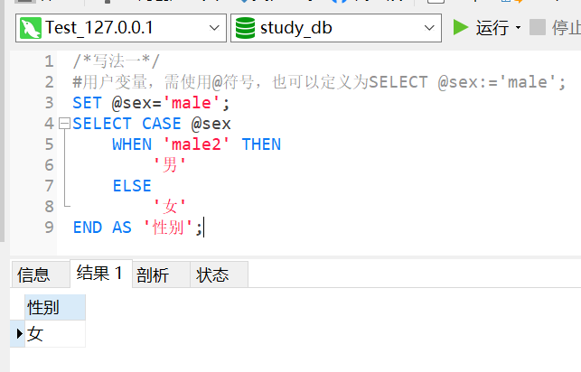

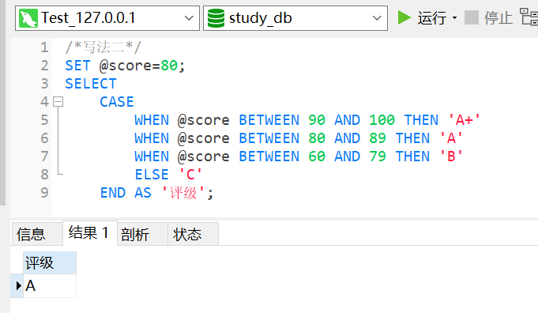

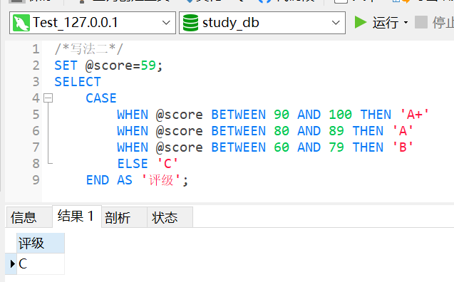

### 其它常用函数

#### DATABASE():返回当前数据库名

```mysql
SELECT DATABASE();
```

说明：SQL Server中对应的函数是DB_NAME。

```mysql
--方法一
SELECT DB_NAME()
--方法二
SELECT NAME FROM MASTER..SYSDATABASES WHERE DBID=(SELECT DBID FROM MASTER..SYSPROCESSES WHERE SPID = @@SPID)
```

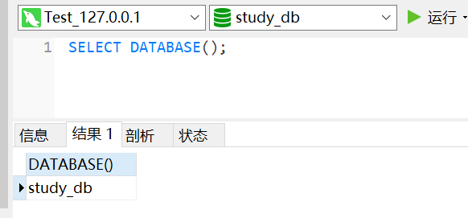

#### VERSION():返回当前数据库版本

```mysql
SELECT VERSION();
```

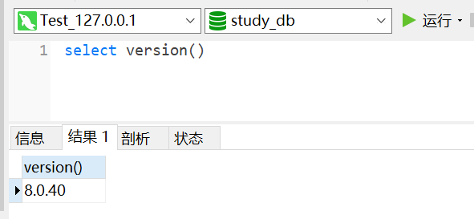

#### USER():返回当前登录用户名

```mysql
SELECT USER();
```


> 说明：SQL Server中对应的函数是SUSER_NAME。

```mysql
SELECT SUSER_NAME()
```

#### hashed_password:返回str的PASSWORD加密值

```mysql
SHA-224: 使用 SHA2('abc', 224)，生成 224 位的哈希值。
SHA-384: 使用 SHA2('abc', 384)，生成 384 位的哈希值。
SHA-512: 使用 SHA2('abc', 512)，生成 512 位的哈希值。
SELECT SHA2('abc', 256) AS hashed_password;
```

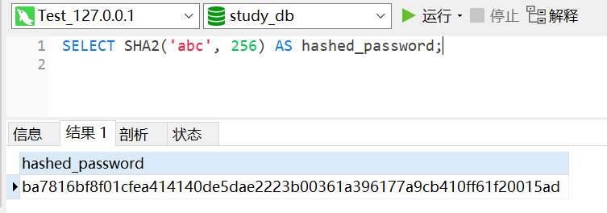

#### MD5(str):返回str的MD5值

```mysql
SELECT MD5('abc');
```

说明：SQL Server中对应的函数是HASHBYTES。

```mysql
SELECT HASHBYTES('MD5','abc')
```

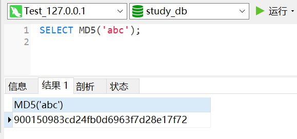


