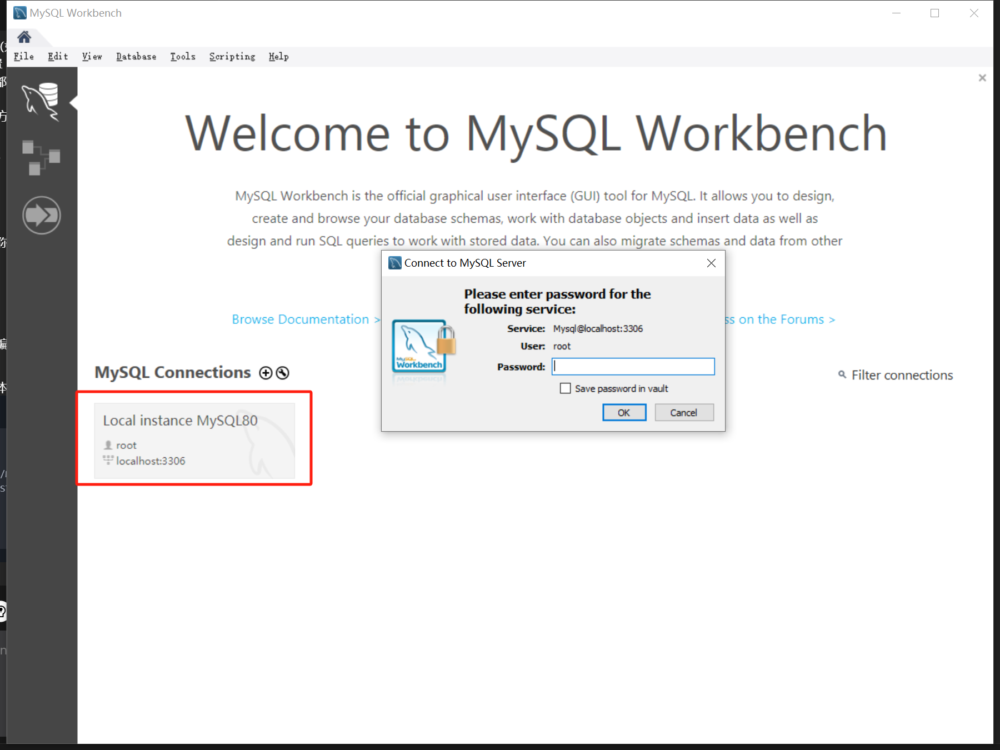
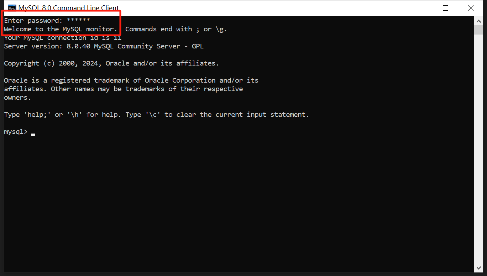
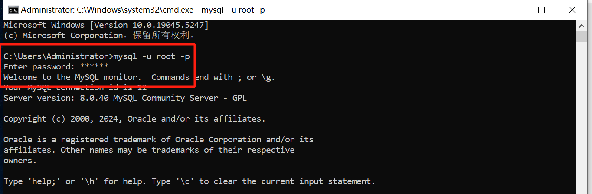
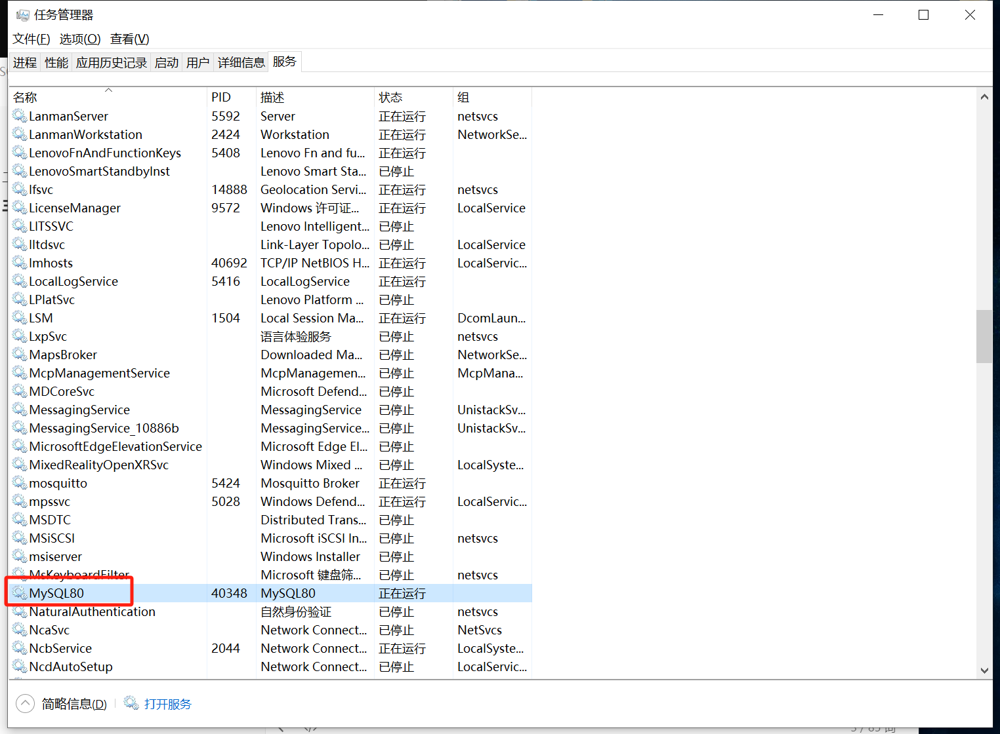
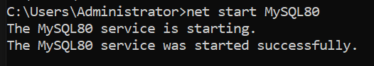

https://www.cnblogs.com/atomy/p/13628376.html

## 安装MySQL

[MySQL下载链接](https://dev.mysql.com/downloads/installer/)

### 安装验证

#### 1.通过Workbench验证

[MySQL Workbench下载链接](https://dev.mysql.com/downloads/workbench/)



输入Root密码，点击"OK"。如果能正常登录，证明安装是成功的

#### 2.通过MySQL 8.0 Command Line Client验证



#### 3.Windows下的命令操作符验证

先配置环境变量

登陆MySQL

```
mysql -u root -p
```



### 环境变量

此电脑-属性-高级系统设置-环境变量-系统变量-Path-编辑-新建

输入"C:\Program Files\MySQL\MySQL Server 8.0\bin"，然后依次点击"确定"


选择mysql数据库

```
use mysql
```


## 修改Root密码

假如需要把Root密码改成"123456"，操作命令如下：

```c#
use mysql;
ALTER USER 'root'@'localhost' IDENTIFIED BY '123456';
flush privileges;
```


## 允许Root远程登录

```
use mysql;

```

## 启动服务





