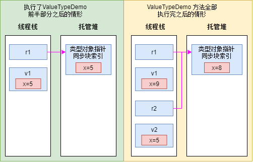

## 引用类型与值类型

### 引用类型

> 假设你有一个 **快递单**（引用变量），上面写着某个仓库（堆）中某个货架的地址（内存地址）。快递单本身很小，可以放在你的口袋里（栈），但实际的货物（对象数据）存放在仓库的货架上（堆）。
>
> - **快递单** = 引用变量（存储地址）
> - **货架上的货物** = 堆中的对象实际数据
> - **仓库** = 托管堆（内存区域）

**引用类型总是从托管堆分配， C# 的 `new` 操作符返回对象内存地址 —— 即指向对象数据的内存地址**。使用引用类型必须留意性能问题。首先要认清楚以下四个事实。

1. **内存必须从托管堆分配。**
2. **堆上分配的每个对象都有一些额外成员，这些成员必须初始化。**
   - **对象头（Object Header）**：
     - **同步块索引（Sync Block Index）**：用于支持对象的同步功能。当对象被锁定时，CLR会在同步块索引中记录锁定对象的信息，以确保多线程环境下的正确同步。
     - **类型对象指针（Type Object Pointer）**：指向对象的类型信息，即 类型方法表（Method Table），包含类型元数据（如方法、字段、继承关系等）。这使得CLR能够识别对象的类型，并在运行时执行类型检查和多态操作。
   - **扩展类型信息（Extended Type Information）**：包含了一些额外的类型信息，比如对象的哈希码、方法表等。
   - **数组长度（Array Length）**：对于数组对象而言，会包含数组的长度信息，以便在运行时进行边界检查
3. **对象中的其他字节(为字段而设)总是设为零。**
4. **从托管堆分配对象时，可能强制执行一次垃圾回收。**

### 值类型

**值类型的实例一般在线程栈上分配(虽然也可作为字段嵌入引用类型的对象中)**。在代表值类型实例的变量中不包含指向实例的指针。相反，变量中包含了实例本身的字段。由于变量已包含了实例的字段，所以操作实例中的字段不需要提领指针。值类型的实例不受垃圾回收器的控制。因此，**值类型的使用缓解了托管堆的压力，并减少了应用程序生存期内的垃圾回收次数**。

所有结构都是抽象类型 `System.ValueType` 的直接派生类。 `System.ValueType` 本身又直接从 `System.Object` 派生。根据定义，所有值类型都必须从 `System.ValueType` 派生。所有枚举都从 `System.Enum` 抽象类型派生，后者又从 `System.ValueType` 派生

虽然不能在定义值类型时为它选择基类型，但如果愿意，值类型可实现一个或多个接口。除此之外，所有值类型都隐式密封，目的是防止将值类型用作其他引用类型或值类型的基类型。例如，无法将 `Boolean`，`Char`，`Int32`，`UInt64`，`Single`，`Double`，`Decimal`等作为基类型来定义任何新类型。

### 演示区别

 ```C#
// 引用类型
//类的实例（引用类型）始终分配在托管堆上，而类内部的 值类型字段（如 Int32 x）的存储位置取决于其所属对象的分配位置
class SomeRef { public Int32 x; }

// 值类型
struct SomeVal { public Int32 x; }

static void ValueTypeDemo()
{
    SomeRef r1 = new SomeRef();  // 在堆上分配
    SomeVal v1 = new SomeVal();  // 在栈上分配
    rl.x = 5;                    // 提领指针
    v1.x = 5;                    // 在栈上修改
    Console.WriteLine(r1.x);     // 显示 “5”
    Console.WriteLine(v1.x);     // 同样显示 “5”

    // 下图 的左半部分反映了执行以上代码之后的情况
    SomeRef r2 = r1;             // 只复制引用(指针)
    SomeVal v2 = v1;             // 在栈上分配并复制成员
    rl.x = 8;                    // r1.x 和 r2.x 都会更改
    v1.x = 9;                    // v1.x 会更改， v2.x 不变
    Console.WriteLine(r1.x);     // 显示 "8"
    Console.WriteLine(r2.x);     // 显示 "8"
    Console.WriteLine(v1.x);     // 显示 "9"
    Console.WriteLine(v2.x);     // 显示 "5"
}
 ```



图解代码执行时的内存分配情况  

上述代码中有这样一行：

```C#
SomeVal vl = new SomeVal();    // 在栈上分配
```

因为这行代码的写法，似乎是要在托管堆上分配一个 `SomeVal` 实例。但 C# 编译器知道 `SomeVal` 是值类型，所以会生成正确的 IL 代码，在线程栈上分配一个 `SomeVal` 实例。 C# 还会确保值类型中的所有字段都初始化为零。

上述代码还可以像下面这样写：

```C#
SomeVal v1;    // 在栈上分配 
```

这一行生成的 IL 代码也会在线程栈上分配实例，并将字段初始化为零。唯一的区别在于，**如果使用 `new` 操作符，C# 会认为实例已初始化**。以下代码更清楚地进行了说明：  

```C#
// 这两行代码能通过编译，因为 C# 认为 v1 的字段已初始化为 0
SomeVal v1 = new SomeVal();
Int32 a = v1.x;

// 这两行代码不能通过编译，因为 C# 不认为
// v1 的字段已初始化为 0
SomeVal v1；
Int32 a = v1.x;   // error CS0170：使用了可能未赋值的字段 “x” 
```

设计自己的类型时，要仔细考虑类型是否应该定义成值类型而不是引用类型。值类型有时能提供更好的性能。具体地说，除非满足以下全部条件，否则不应该将类型声明为值类型。

* **类型具有基元类型的行为。也就是说，是十分简单的类型，没有成员会修改类型的任何实例字段。如果类型没有提供会更改其字段的成员，就说该类型是不可变(immutable)类型。事实上，对于许多值类型，我们都建议将全部字段标记为 readonly(详情参见第 7 章 “常量和字段”)。**

* **类型不需要从其他任何类型继承。**

* **类型也不派生出其他任何类型**。

类型实例大小也应在考虑之列，因为实参默认以传值方式传递，造成对值类型实例中的字段进行复制，对性能造成损害。同样地，被定义为返回一个值类型的方法在返回时，实例中的字段会复制到调用者分配的内存中，对性能造成损害。所以，要将类型声明为值类型，除了要满足以上全部条件，还必须满足以下任意条件。

* **类型的实例较小(16 字节或更小)。**

* **类型的实例较大(大于 16 字节)，但不作为方法实参传递，也不从方法返回**。

值类型的主要优势是不作为对象在托管堆上分配。当然，与引用类型相比，值类型也存在自身的一些局限。下面列出了值类型和引用类型的一些区别。

### 区别

|         **特性**      |                   **值类型 (Value Type)**                    |                **引用类型 (Reference Type)**                 |
| :----------------------- | :----------------------------------------------------------- | :----------------------------------------------------------- |
|         **基类**      |   派生自 `System.ValueType`（间接派生自 `System.Object`）    |                  直接派生自 `System.Object`                  |
|       **内存分配**    | 默认在 **栈** 上（未装箱）或 **堆** 上（已装箱，通过 `object` 装箱） |                   始终在 **托管堆** 上分配                   |
|     **变量赋值行为**  |                 **逐字段复制**（复制整个值）                 |                **复制地址**（指向同一堆对象）                |
|  **默认 `Equals` 实现**  |       `System.ValueType` 重写，比较 **字段值是否相等**       |        `System.Object` 默认比较 **引用地址是否相同**         |
|      **虚方法支持**      | **不允许** 定义新的虚方法或抽象方法（所有方法隐式 `sealed`） |      **允许** 定义虚方法、抽象方法，支持继承和方法重写       |
|      **变量默认值**      | 所有字段初始化为 **0**（如 `int` 默认为 `0`，`struct` 字段按默认值初始化） |            变量默认值为 `null`（不指向任何对象）             |
| **可空性 (Nullability)** |      通过 `Nullable<T>` 或语法糖 `T?` 支持（如 `int?`）      |               原生支持 `null`（如 `string?`）                |
|       **异常风险**       |         不会因访问变量抛出 `NullReferenceException`          |       可能因 `null` 引用抛出 `NullReferenceException`        |
|     **对象相互影响**     |             变量独立，操作一个变量不影响其他变量             | 多个变量可能指向同一对象，操作一个变量可能影响其他变量引用的对象 |
|       **内存释放**       |      栈分配的值类型在方法结束后 **立即释放**（无需 GC）      |    堆分配的对象由 **垃圾回收器 (GC)** 自动管理，延迟释放     |
|       **典型示例**       |          `int`, `double`, `struct`（如 `DateTime`）          |              `class`, `string`, `object`, 数组               |


## 值类型的装箱和拆箱

```c#
// 声明值类型
struct Point
{
    public Int32 x, y;
}

public sealed class Program 
{
    public static void Main()
    {
        ArrayList a = new ArrayList(); // 类型不安全
        Point p; // 分配一个 Point (不在堆中分配)
        for (Int32 i = 0; i < 10; i++)
        {
            p.x = p.y = i; // 初始化值类型中成员
            a.Add(p); // 对值类型装箱，将引用添加到 ArrayList 中
        }
        ...
        Point p = (Point) a[0];
    }
}
```

### 装箱

1. 在托管堆中分配内存。分配的内存量是值类型各字段所需的内存量，还要加上托管堆所有对象都有的两个额外成员(类型对象指针和同步块索引)所需的内存量。
2. 值类型的字段复制到新分配的堆内存。
3. 返回对象地址。现在该地址是对象引用；值类型成了引用类型。

### 拆箱

```c#
Point p = (Point) a[0];
```

它获取 `ArrayList` 的元素0包含的引用(或指针)，试图将其放到 `Point` 值类型的实例 `p` 中。为此，已装箱 `Point` 对象中的所有字段都必须复制到值类型变量 `p` 中，后者在线程栈上。 CLR 分两步完成复制。

1. 获取已装箱 `Point` 对象中的各个 `Point` 字段的地址。这个过程称为**拆箱**(unboxing)。
2. 将字段包含的值从堆复制到基于栈的值类型实例中。

### 举例1

#### 第一版

```c#
public static void Main()
{
    Int32 v = 5;       // 创建未装箱值类型变量
    Object o = v;      // o 引用已装箱的、包含值 5 的 Int32
    v = 123;           // 将未装箱的值修改成 123
    Console.WriteLine(v + "," + (Int32)o);     // 显示 "123,5"
}
```

```IL
.method public hidebysig static void  Main() cil managed
{
    .entrypoint
    // 代码大小       45 (0x2d)
    .maxstack  3
    .locals init ([0] int32 v,
    [1] object o)
    // 将 5 加载到 v 中
    IL_0000:  ldc.i4.5
    IL_0001:  stloc.0

    // 将 v 装箱，将引用指针存储到 o 中
    IL_0002:  ldloc.0
    IL_0003:  box        [mscorlib]System.Int32
    IL_0008:  stloc.1

    // 将 123 加载到 v 中
    IL_0009:  ldc.i4.s   123
    IL_000b:  stloc.0

    // 对 v 装箱，将指针保留在栈上以进行 Concat (连接)操作
    IL_000c:  ldloca.s   v
    IL_000d:  box       [mscorlib]System.Int32

    // 将字符串加载到栈上以执行 Concat 操作
    IL_0012:  ldstr      ","

    // 对 o 拆箱：获取一个指针，它指向栈上的 Int32 字段
    IL_0017:  ldloc.1
    IL_0018:  unbox.any  [mscorlib]System.Int32

    // 对 Int32 装箱，将指针保留在栈上以进行 Concat 操作
    IL_001d:  box       [mscorlib]System.Int32

    // 调用 Concat
    IL_0022:  call       string [mscorlib]System.String::Concat(object,
    object,
    object)

    // 将从 Concat 返回的字符串传给 WriteLine
    IL_0027:  call       void [mscorlib]System.Console::WriteLine(string)

    // 从 Main 返回，终止应用程序
    IL_002c:  ret
} // end of method App::Main
```

1. 在栈上创建一个 `Int32` 未装箱值类型实例( `v` )，将其初始化为 `5` 。

2. 再创建 `Object` 类型的变量( `o` )并初始化，让它指向 v 。但由于引用类型的变量始终指向堆中的对象，所以 C# 生成正确的 IL 代码**对 `v` 进行装箱**，将 `v` 的已装箱拷贝的地址存储到 `o` 中。

3. 接着，值 `123` 被放到未装箱值类型实例 `v` 中，但这个操作不会影响已装箱的 `Int32` ，后者的值依然为 `5`。

4. 接着调用 `WriteLine` 方法， `WriteLine` 要求获取一个 `String` 对象，但当前没有 `String` 对象。相反，现在有三个数据项：一个未装箱的 `Int32` 值类型实例( `v` )，一个 `String` (它是引用类型)，以及对已装箱 `Int32` 值类型实例的引用( `o` )，它要转型为未装箱的 `Int32` 。必须以某种方法合并这些数据项来创建一个 `String` 。

5. 为了创建一个 `String` ，C# 编译器生成代码来调用 `String` 的静态方法 `Concat` 。 该方法有几个重载版本，所有版本执行的操作都一样，只是参数的数量不同。由于需要连接三个数据项来创建字符串，所以编译器选择 `Concat` 方法的以下版本：

   ```c#
   public static String Concat(Object arg0, Object arg1, Object arg2);
   ```

   为第一个参数 `arg0` 传递的是 `v`。但 `v` 是未装箱的值参数，而 `arg0` 是 `Object`，所以必须**对 `v` 进行装箱**，并将已装箱的 `v` 的地址传给 `arg0` 。 对于 `arg1` 参数，字符串`“,”`作为 `String` 对象引用传递。对于 `arg2` 参数， `o` (一个 `Object` 引用)会转型为 `Int32` 。这要求执行拆箱(但不紧接着执行复制)，从而获取包含在已装箱 `Int32` 中的未装箱 `Int32` 的地址。这个**未装箱的 `Int32` 实例必须再次装箱**，并将新的已装箱实例的内存地址传给 `Concat` 的 `arg2` 参数。

`Concat` 方法调用指定的每个对象的 `ToString` 方法，将每个对象的字符串形式连接起来。从 `Concat` 返回的 `String` 对象传给 `WriteLine` 方法以显示最终结果。

#### 第二版

应该指出，如果像下面这样写 `WriteLine` 调用，生成的 IL 代码将具有更高的执行效率：

```c#
Console.WriteLine(v + "," + o);     // 显示 "123,5"
```

这和前面的版本几乎完全一致，只是移除了变量 `o` 之前的( `Int32` )强制转型。之所以效率更高，是因为 `o` 已经是指向一个 `Object` 的引用类型，它的地址可直接传给 `Concat` 方法。所以，移除强制转型避免了两次操作：一次拆箱和一次装箱。不妨重新生成应用程序，观察 IL 代码来体会避免的额外操作：

```c#
.method public hidebysig static void  Main() cil managed
{
  .entrypoint
  // 代码大小       35 (0x23)
  .maxstack  3
  .locals init ([0] int32 v,
           [1] object o)
  // 将 5 加载到 v 中
  IL_0000:  ldc.i4.5
  IL_0001:  stloc.0

  // 将 v 装箱，将引用指针存储到 o 中
  IL_0002:  ldloc.0
  IL_0003:  box        [mscorlib]System.Int32
  IL_0008:  stloc.1

  // 将 123 加载到 v 中
  IL_0009:  ldc.i4.s   123
  IL_000b:  stloc.0

  // 对 v 装箱，将指针保留在栈上以进行 Concat (连接)操作
  IL_000c:  ldloca.s   v
  IL_000d:  box       [mscorlib]System.Int32

  // 将字符串加载到栈上以执行 Concat 操作
  IL_0012:  ldstr      ","

  // 将已装箱 Int32 的地址加载到栈上以执行 Concat 操作
  IL_0017:  ldloc.1

  // 调用 Concat
  IL_0018:  call       string [mscorlib]System.String::Concat(object,
                                                              object,
                                                              object)

  // 将从 Concat 返回的字符串传给 WriteLine
  IL_001d:  call       void [mscorlib]System.Console::WriteLine(string)
  
  // 从 Main 返回，终止应用程序
  IL_0022:  ret
} // end of method App::Main
```

简单对比一下两个版本的 `Main` 方法的 IL 代码，会发现没有( `Int32` )转型的版本比有转型的版本小了 10 字节。第一个版本额外的拆箱/装箱步骤显然会生成更多的代码。更大的问题是，额外的装箱步骤会从托管堆中分配一个额外的对象，将来必须对其进行垃圾回收。这两个版本的结果一样，速度上的差别也并不明显。但是，假如在循环中发生额外的、不必要的装箱操作，就会严重影响应用程序的性能和内存消耗。

#### 第三版

甚至可以这样调用 `WriteLine` ，进一步提升上述代码的性能：

```c
 Console.WriteLine(v.ToString() + "," + o);     // 显示 "123,5"
```

这会为未装箱的值类型实例 `v` 调用 `ToString` 方法，它返回一个 `String` 。 `String` 对象已经是引用类型，所以能直接传给 `Concat` 方法，不需要任何装箱操作。


### 举例2

```c#
public static void Main() 
{
    Int32 v = 5;              // 创建未装箱的值类型变量
    Object o = v;             // o 引用 v 的已装箱版本

    v = 123;                  // 将未装箱的值类型修改成 123
    Console.WriteLine(v);     // 显示 “123”
    v = (Int32)o;             // 拆箱并将 o 复制到 v
    Console.WriteLine(v);     // 显示 “5”
}
```

上述代码发生了多少次装箱？答案是一次。之所以只发生一次装箱，是因为 `System.Console` 类已定义了获取单个 `Int32` 参数的 `WriteLine` 方法：

```c#
public static void WriteLine(Int32 value);
```

在前面对 `WriteLine` 的两次调用中，变量 `v` ( `Int32` 未装箱值类型实例)以传值方式传给方法。虽然 `WriteLine` 方法也许会在它自己内部对 `Int32` 装箱，但这已经不在我们的控制范围之内了。最重要的是，我们已尽可能地在*自己*的代码中减少了装箱。

仔细研究一下 FCL，会发现许多方法都针对不同的值类型参数进行了重载。例如， `System.Console` 类型提供了 `WriteLine` 方法的几个重载版本：

```c#
public static void WriteLine(Boolean);
public static void WriteLine(Char);
public static void WriteLine(Char[]);
public static void WriteLine(Int32);
public static void WriteLine(UInt32);
public static void WriteLine(Int64);
public static void WriteLine(UInt64);
public static void WriteLine(Single);
public static void WriteLine(Double);
public static void WriteLine(Decimal);
public static void WriteLine(Object);
public static void WriteLine(String);
```

以下几个方法也有一组类似的重载版本：`System.Console` 的 `Write` 方法， `System.IO.BinaryWriter` 的 `Write` 方法， `System.IO.TextWriter` 的 `Write` 和 `WriteLine` 方法， `System.Runtime.Serialization.SerializationInfo` 的 `AddValue` 方法， `System.Text.StringBuilder` 的 `Append` 和 `Insert` 方法。大多数方法进行重载唯一的目的就是减少常用类型的装箱次数。

但这些 FCL 类的方法不可能接受你自己定义的值类型。另外，即使是 FCL 中定义好的值类型，这些方法也可能没有提供对应的重载版本。调用方法并传递值类型时，如果不存在与值类型对应的重载版本，那么调用的肯定是获取一个 `Object` 参数的重载版本。将值类型实例作为 `Object` 传递会造成装箱，从而对性能造成不利影响。定义自己的类时，可将类中的方法定义为泛型(通过类型约束将类型参数限制为值类型)。这样方法就可获取任何值类型而不必装箱。

### 注意

**如果知道自己的代码会造成编译器反复对一个值类型装箱，请改成用手动方式对值类型进行装箱**。这样代码会变得更小、更快。下面是一个例子：

```c#
using System;

public sealed class Program
{
    public static void Main() 
    {
        Int32 v = 5;      // 创建未装箱的值类型变量

        #if INEFFICIENT
            // 编译下面这一行， v 被装箱 3 次，浪费时间和内存
            Console.WriteLine("{0}, {1}, {2}", v, v, v);
        #else
            // 下面的代码结果一样，但无论执行速度，还是内存利用，都比前面的代码更胜一筹
            Object o = v;     // 对 v 进行手动装箱(仅 1 次)

        // 编译下面这一行不发生装箱
        Console.WriteLine("{0}, {1}, {2}", o, o, o);
        #endif
    }
}
```

在定义了 `INEFFICIENT` 符号的前提下编译，编译器会生成代码对 `v` 装箱 3 次，造成在堆上分配 3 个对象！这太浪费了，因为每个对象都是完全相同的内容：**5**。在没有定义 `INEFFICIENT` 符号的前提下编译， `v` 只装箱一次，所以只在堆上分配一个对象。随后，在对 `Console.WriteLine` 方法的调用中，对同一个已装箱对象的引用被传递 3 次。第二个版本执行起来快得多，在堆上分配的内存也要少得多。

未装箱值类型比引用类型更“轻”。这要归结于以下两个原因。

- **不在托管堆上分配。**

- **没有堆上的每个对象都有的额外成员：“类型对象指针” 和 “同步块索引”。**

将值类型的未装箱实例转型为类型的某个接口时要对实例进行装箱。这是因为接口变量必须包含对堆对象的引用(接口主题将在第 13 章“接口”中讨论)。以下代码对此进行了演示：

```C#
using System;

internal struct Point : IComparable 
{
    private Int32 m_x, m_y;

    // 构造器负责初始化字段
    public Point(Int32 x, Int32 y)
    {
        m_x = x;
        m_y = y;
    }

    // 重写从 System.ValueType 继承的 ToString 方法
    public override string ToString()
    {
        // 将 point 作为字符串返回。注意：调用 ToString 以避免装箱
        return String.Format("({0}, {1})", m_x.ToString(), m_y.ToString());
    }

    // 实现类型安全的 CompareTo 方法
    public Int32 CompareTo(Point other)
    {
        // 利用勾股定理计算哪个 point 距离原点 (0, 0) 更远
        return Math.Sign(Math.Sqrt(m_x * m_x + m_y * m_y) - Math.Sqrt(other.m_x * other.m_x + other.m_y * other.m_y));
    }

    // 实现 IComparable 的 CompareTo 方法
    public Int32 CompareTo(Object o)
    {
        if(GetType() != o.GetType())
        {
            throw new ArgumentException("o is not a Point");
        }
        // 调用类型安全的 CompareTo 方法
        return CompareTo((Point)o);
    }
}

public static class Program
{
    public static void Main()
    {
        // 在栈上创建两个 Point 实例
        Point p1 = new Point(10, 10);
        Point p2 = new Point(20, 20);

        // 调用 ToString (虚方法)不装箱 p1
        Console.WriteLine(p1.ToString());      // 显示 "(10, 10)"

        // 调用 GetType (非虚方法)时，要对 p1 进行装箱
        Console.WriteLine(p1.GetType());       // 显示 "Point"

        // 调用 CompareTo 不装箱 p1 
        // 由于调用的是 CompareTo(Point) ，所以 p2 不装箱
        Console.WriteLine(p1.CompareTo(p2));   // 显示 "-1"

        // p1 要装箱，引用放到 c 中
        IComparable c = p1;
        Console.WriteLine(c.GetType());        // 显示 "Point"

        // 调用 CompareTo 不装箱 p1
        // 由于向 CompareTo 传递的不是 Point 变量，
        // 所以调用的是 CompareTo(Object) ，它要求获取对已装箱 Point 的引用
        // c 不装箱是因为它本来就引用已装箱 Point
        Console.WriteLine(p1.CompareTo(c));    // 显示 "0"

        // c 不装箱，因为它本来就引用已装箱 Point
        // p2 要装箱，因为调用的是 CompareTo(Object)
        Console.WriteLine(c.CompareTo(p2));    // 显示 "-1"

        // 对 c 拆箱，字段复制到 p2 中
        p2 = (Point) c;

        // 证明字段已复制到 p2 中
        Console.WriteLine(p2.ToString());      // 显示 "(10, 10)"
    }
}
```

上述代码演示了涉及装箱和拆箱的几种情形。

1. 调用 `ToString`
   调用 `ToString` 时 `p1` 不必装箱。表面看 `p1` 似乎必须装箱，因为 `ToString` 是从基类型 `System.ValueType` 继承的虚方法。通常，为了调用虚方法，CLR 需要判断对象的类型来定位类型的方法表。由于 `p1` 是未装箱的值类型，所以不存在“类型对象指针”。但 JIT 编译器发现 `Point` 重写了 `ToString` 方法，所以会生成代码来直接(非虚地)调用 `ToString` 方法，而不必进行任何装箱操作。编译器知道这里不存在多态性问题，因为 `Point` 是值类型，没有类型能从它派生以提供虚方法的另一个实现。但假如 `Point` 的 `ToString` 方法在内部调用 `base.ToString()` ，那么在调用 `System.ValueType` 的 `ToString` 方法时，值类型的实例会被装箱。
2. 调用`GetType`
   调用非虚方法 `GetType` 时 `p1` 必须装箱。`Point` 的 `GetType` 方法是从 `System.Object` 继承的。所以，为了调用 `GetType` ，CLR 必须使用指向类型对象的指针，而这个指针只能通过装箱 `p1` 来获得。
3. 调用 `CompareTo` (第一次)
   第一次调用 `CompareTo` 时 `p1` 不必装箱，因为 `Point` 实现了 `CompareTo` 方法，编译器能直接调用它。注意向 `CompareTo` 传递的是一个 `Point` 变量(`p2`)，所以编译器调用的是获取一个 `Point` 参数的 `CompareTo` 重载版本。这意味着 `p2` 以传值方式传给 `CompareTo`，无需装箱。
4. 转型为 `IComparable`
   `p1`转型为接口类型的变量 `c` 时必须装箱，因为接口被定义为引用类型。装箱 `p1` 后，指向已装箱对象的指针存储到变量 `c` 中。后面对 `GetType` 的调用证明 `c` 确实引用堆上的已装箱 `Point`。
5. 调用 `CompareTo` (第二次)
   第二次调用 `CompareTo` 时 `p1` 不必装箱，因为 `Point` 实现了 `CompareTo` 方法，编译器能直接调用。注意向 `CompareTo` 传递的是 `IComparable` 类型的变量 `c` ，所以编译器调用的是获取一个 `Object` 参数的 `CompareTo` 重载版本。这意味着传递的实参必须是指针，必须引用堆上一个对象。幸好， `c` 确实引用一个已装箱 `Point`， 所以 `c` 中的内存地址直接传给 `CompareTo` ，无需额外装箱。
6. 调用 `CompareTo` (第三次)
   第三次调用 `CompareTo` 时， `c` 本来就引用堆上的已装箱 `Point` 对象，所以不装箱。由于 `c` 是 `IComparable` 接口类型，所以只能调用接口的获取一个 `Object` 参数的 `CompareTo` 方法。这意味着传递的实参必须是引用了堆上对象的指针。所以 `p2` 要装箱，指向这个已装箱对象的指针将传给 `CompareTo`。
7. 转型为`Point`
   将 `c` 转型为 `Point` 时， `c` 引用的堆上对象被拆箱，其字段从堆复制到 `p2`。`p2` 是栈上的 `Point` 类型实例。

### 使用接口更改已装箱值类型中的字段

```c#
using System;

// Point 是值类型
internal struct Point 
{
    private Int32 m_x, m_y;

    public Point(Int32 x, Int32 y) 
    {
        m_x = x;
        m_y = y;
    }
    public void Change(Int32 x, Int32 y)
    {
        m_x = x; m_y = y;
    }

    public override string ToString() 
    {
        return String.Format("({0}, {1})", m_x.ToString(), m_y.ToString());
    }
}

public sealed class Program 
{
    public static void Main() 
    {
        Point p = new Point(1, 1);

        Console.WriteLine(p);

        p.Change(2, 2);
        Console.WriteLine(p);

        Object o = p;
        Console.WriteLine(o);

        ((Point)o).Change(3, 3);
        Console.WriteLine(o);
    }
}
```

