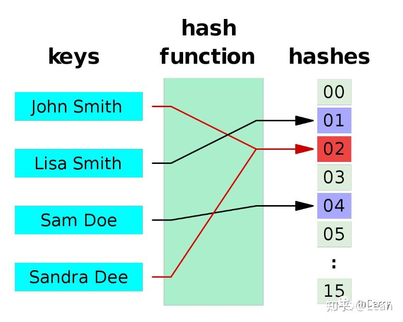
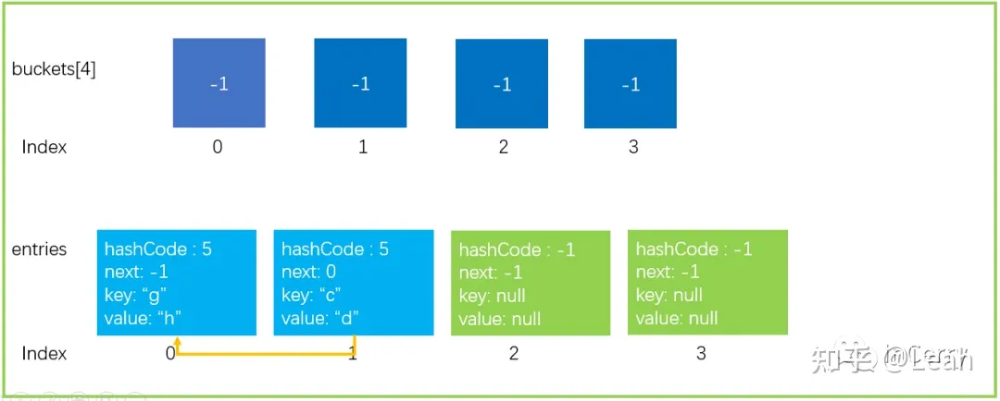

# C#进阶【字典实现原理】

## 理论知识

对于 Dictionary 的实现原理，其中有两个关键的算法，一个是**Hash算法**，一个是用于**应对 Hash 碰撞冲突解决算法**

### **1、Hash 算法**

Hash 算法是一种**数字摘要**算法，它能将不定长度的二进制数据集给**映射**到一个较短的二进制长度数据集，常见的 MD5 算法就是一种 Hash 算法，通过 MD5 算法可对任何数据生成数字摘要。而实现了 Hash 算法的函数我们叫它**Hash 函数**。Hash 函数有以下几点特征：

1. 相同的数据进行 Hash 运算，得到的结果一定相同。`HashFunc(key1) == HashFunc(key1)`
2. 不同的数据进行 Hash 运算，其结果也可能会相同，(**Hash 会产生碰撞**)。`key1 != key2 => HashFunc(key1) == HashFunc(key2)`.
3. Hash 运算时不可逆的，不能由 key 获取原始的数据。`key1 => hashCode`但是`hashCode =\=> key1`。

下图就是 Hash 函数的一个简单说明，任意长度的数据通过 HashFunc 映射到一个较短的数据集中


关于 Hash 碰撞下图很清晰的就解释了，可从图中得知`Sandra Dee` 和 `John Smith`通过 hash 运算后都落到了`02`的位置，产生了碰撞和冲突。



常见的构造 Hash 函数的算法有以下几种。

> **1. 直接寻址法：**取 keyword 或 keyword 的某个线性函数值为散列地址。即 H(key)=key 或 H(key) = a•key + b，当中 a 和 b 为常数（这样的散列函数叫做自身函数）
> **2. 数字分析法：**分析一组数据，比方一组员工的出生年月日，这时我们发现出生年月日的前几位数字大体同样，这种话，出现冲突的几率就会非常大，可是我们发现年月日的后几位表示月份和详细日期的数字区别非常大，假设用后面的数字来构成散列地址，则冲突的几率会明显减少。因此数字分析法就是找出数字的规律，尽可能利用这些数据来构造冲突几率较低的散列地址。
> **3. 平方取中法：**取 keyword 平方后的中间几位作为散列地址。
> **4. 折叠法：**将 keyword 切割成位数同样的几部分，最后一部分位数能够不同，然后取这几部分的叠加和（去除进位）作为散列地址。
> **5. 随机数法：**选择一随机函数，取 keyword 的随机值作为散列地址，通经常使用于 keyword 长度不同的场合。
> **6. 除留余数法：**取 keyword 被某个不大于散列表表长 m 的数 p 除后所得的余数为散列地址。即 H(key) = key MOD p, p<=m。不仅能够对 keyword 直接取模，也可在折叠、平方取中等运算之后取模。对 p 的选择非常重要，一般取素数或 m，若 p 选的不好，容易产生碰撞.

### **2、Hash 桶算法**

说到 Hash 算法大家就会想到**Hash 表**，一个 Key 通过 Hash 函数运算后可快速的得到 hashCode，通过 hashCode 的映射可直接 Get 到 Value，但是 hashCode 一般取值都是非常大的，经常是 2^32 以上，不可能对每个 hashCode 都指定一个映射。

因为这样的一个问题，所以人们就将生成的 HashCode 以分段的形式来映射，把每一段称之为一个**Bucket（桶）**，一般常见的 Hash 桶就是直接对结果取余。

> 假设将生成的 hashCode 可能取值有 2^32 个，然后将其切分成一段一段，使用**8**个桶来映射，那么就可以通过`bucketIndex = HashFunc(key1) % 8`这样一个算法来确定这个 hashCode 映射到具体的哪个桶中。

大家可以看出来，通过 hash 桶这种形式来进行映射，所以会加剧 hash 的冲突。

### **3、解决冲突算法**

对于一个 hash 算法，不可避免的会产生冲突，那么产生冲突以后如何处理，是一个很关键的地方，目前常见的冲突解决算法有**拉链法(Dictionary 实现采用的)、开放定址法、再 Hash 法、公共溢出分区法**，本文只介绍拉链法与再 Hash 法，对于其它算法感兴趣的同学可参考文章最后的参考文献。

> **1. 拉链法：**这种方法的思路是将产生冲突的元素建立一个单链表，并将头指针地址存储至 Hash 表对应桶的位置。这样定位到 Hash 表桶的位置后可通过遍历单链表的形式来查找元素。
> **2. 再 Hash 法：**顾名思义就是将 key 使用其它的 Hash 函数再次 Hash，直到找到不冲突的位置为止。

对于拉链法有一张图来描述，通过在冲突位置建立单链表，来解决冲突。


## **Dictionary 实现**

Dictionary 实现我们主要对照源码来解析，目前对照源码的版本是**.Net Framwork 4.7**。地址可戳一戳这个链接 源码地址：**Link[1]**

这一章节中主要介绍 Dictionary 中几个比较关键的类和对象，然后跟着代码来走一遍插入、删除和扩容的流程，相信大家就能理解它的设计原理。

###  Entry 结构体

首先我们引入**Entry**这样一个结构体，它的定义如下代码所示。这是 Dictionary 种存放数据的最小单位，调用`Add(Key,Value)`方法添加的元素都会被封装在这样的一个结构体中。

```c#
private struct Entry
{
    public int hashCode;    // 除符号位以外的31位hashCode值, 如果该Entry没有被使用，那么为-1
    public int next;        // 下一个元素的下标索引，如果没有下一个就为-1
    public TKey key;        // 存放元素的键
    public TValue value;    // 存放元素的值
}
```

### 其它关键私有变量

除了 Entry 结构体外，还有几个关键的私有变量，其定义和解释如下代码所示。

```c#
private int[] buckets;  // Hash桶
private Entry[] entries; // Entry数组，存放元素
private int count;   // 当前entries的index位置
private int version;  // 当前版本，防止迭代过程中集合被更改
private int freeList;  // 被删除Entry在entries中的下标index，这个位置是空闲的
private int freeCount;  // 有多少个被删除的Entry，有多少个空闲的位置
private IEqualityComparer<TKey> comparer; // 比较器
private KeyCollection keys;  // 存放Key的集合
private ValueCollection values;  // 存放Value的集合
```

上面代码中，需要注意的是`buckets、entries`这两个数组，这是实现 Dictionary 的关键。

### Dictionary - Add 操作

经过上面的分析，相信大家还不是特别明白为什么需要这么设计，需要这么做。那我们现在来走一遍 Dictionary 的 Add 流程，来体会一下。

首先我们用图的形式来描述一个 Dictionary 的数据结构，其中只画出了关键的地方。桶大小为 4 以及 Entry 大小也为 4 的一个数据结构。


然后我们假设需要执行一个**Add**操作，`dictionary.Add("a","b")`，其中`key = "a",value = "b"`。

1. 根据**key**的值，计算出它的 hashCode。我们假设"a"的 hash 值为 6（`GetHashCode("a") = 6`）。
2. 通过对 hashCode 取余运算，计算出该 hashCode 落在哪一个 buckets 桶中。现在桶的长度（`buckets.Length`）为 4，那么就是`6 % 4`最后落在`index`为 2 的桶中，也就是`buckets[2]`。
3. 避开一种其它情况不谈，接下来它会将`hashCode、key、value`等信息存入`entries[count]`中，因为`count`位置是空闲的；继续`count++`指向下一个空闲位置。上图中第一个位置，index=0 就是空闲的，所以就存放在`entries[0]`的位置。
4. 将`Entry`的下标`entryIndex`赋值给`buckets`中对应下标的`bucket`。步骤 3 中是存放在`entries[0]`的位置，所以`buckets[2]=0`。
5. 最后`version++`，集合发生了变化，所以版本需要+1。**只有增加、替换和删除元素才会更新版本**
   **上文中的步骤 1~5 只是方便大家理解，实际上有一些偏差，后文再谈 Add 操作小节中会补充。**

完成上面 Add 操作后，数据结构更新成了下图这样的形式。注：**Entry[] entries 的Index的值给到了Int buckets[4]中方块中**


这样是理想情况下的操作，一个 bucket 中只有一个 hashCode 没有碰撞的产生，但是实际上是会经常产生碰撞；那么 Dictionary 类中又是如何解决碰撞的呢。

我们继续执行一个**Add**操作，`dictionary.Add("c","d")`，假设`GetHashCode(“c”)=6`，最后`6 % 4 = 2`。最后桶的`index`也是 2，按照之前的**步骤 1~3**是没有问题的，执行完后数据结构如下图所示。注：**Entry[] entries 的第二个空闲位Index=1填上数据**


如果继续执行**步骤 4**那么`buckets[2] = 1`，然后原来的`buckets[2]=>entries[0]`的关系就会丢失，这是我们不愿意看到的。现在 Entry 中的`next`就发挥大作用了。

> 如果对应的`buckets[index]`有其它元素已经存在，那么会执行以下两条语句，让新的`entry.next`指向之前的元素，让`buckets[index]`指向现在的新的元素，就构成了一个单链表。
> entries[index].next = buckets[targetBucket];
> ...
> buckets[targetBucket] = index;
>
> 实际上**步骤 4**也就是做一个这样的操作，并不会去判断是不是有其它元素，因为`buckets`中桶初始值就是-1，不会造成问题。

经过上面的步骤以后，数据结构就更新成了下图这个样子。

注：

> 1. 原先红色值=0，此时新的Index给到红色，红色值=1,
>
> 2. 因为原先的红色值!=-1，所以Entry[] entryies 的Index=1中的next=上一个红色值
>


### Dictionary - Find 操作

为了方便演示如何查找，我们继续 Add 一个元素`dictionary.Add("e","f")`，`GetHashCode(“e”) = 7; 7% buckets.Length=3`,数据结构如下所示。


假设我们现在执行这样一条语句`dictionary.GetValueOrDefault("a")`，会执行以下步骤.

1. 获取 key 的 hashCode，计算出所在的桶位置。我们之前提到，"a"的`hashCode=6`，所以最后计算出来`targetBucket=2`。
2. 通过`buckets[2]=1`找到`entries[1]`,比较 key 的值是否相等，相等就返回`entryIndex`，不想等就继续`entries[next]`查找，直到找到 key 相等元素或者`next == -1`的时候。这里我们找到了`key == "a"`的元素，返回`entryIndex=0`。
3. 如果`entryIndex >= 0`那么返回对应的`entries[entryIndex]`元素，否则返回`default(TValue)`。这里我们直接返回`entries[0].value`。

整个查找的过程如下图所示.


将查找的代码摘录下来，如下所示。

```c#
// 寻找Entry元素的位置
private int FindEntry(TKey key)
{
    if( key == null)
    {
        ThrowHelper.ThrowArgumentNullException(ExceptionArgument.key);
    }

    if (buckets != null)
    {
        int hashCode = comparer.GetHashCode(key) & 0x7FFFFFFF; // 获取HashCode，忽略符号位
        // int i = buckets[hashCode % buckets.Length] 找到对应桶，buckets[6%4]=1,然后获取entry在entries中位置
        // i >= 0; i = entries[i].next 遍历单链表
        for (int i = buckets[hashCode % buckets.Length]; i >= 0; i = entries[i].next)
        {
            // 找到就返回了
            if (entries[i].hashCode == hashCode && comparer.Equals(entries[i].key, key))
                return i;
        }
    }
    return -1;
}
...
internal TValue GetValueOrDefault(TKey key)
{
    int i = FindEntry(key);
    // 大于等于0代表找到了元素位置，直接返回value
    // 否则返回该类型的默认值
    if (i >= 0)
    {
        return entries[i].value;
    }
    return default(TValue);
}
```

### Dictionary - Remove 操作

前面已经向大家介绍了增加、查找，接下来向大家介绍 Dictionary 如何执行删除操作。我们沿用之前的 Dictionary 数据结构。


删除前面步骤和查找类似，也是需要找到元素的位置，然后再进行删除的操作。

我们现在执行这样一条语句`dictionary.Remove("a")`，hashFunc 运算结果和上文中一致。步骤大部分与查找类似，我们直接看摘录的代码，如下所示。

```c#
public bool Remove(TKey key)
{
    if(key == null)
    {
        ThrowHelper.ThrowArgumentNullException(ExceptionArgument.key);
    }

    if (buckets != null)
    {
        int hashCode = comparer.GetHashCode(key) & 0x7FFFFFFF; // 1. 通过key获取hashCode
        int bucket = hashCode % buckets.Length;// 2. 取余获取bucket位置,bucket=6%4=2
        int last = -1; // last用于确定是否当前bucket的单链表中最后一个元素
        // 3. 遍历bucket对应的单链表
        //i = buckets[2] = 1;不执行if
        //last = 1,i= entries[1].next = 0,entries[1].next = entries[0].next = -1;
        // entries[1]=0--->entries[1]=-1
        for (int i = buckets[bucket]; i >= 0; last = i, i = entries[i].next)
        {
            if (entries[i].hashCode == hashCode && comparer.Equals(entries[i].key, key))
            {
// 4. 找到元素后，如果last< 0，代表当前是bucket中最后一个元素，那么直接让bucket内下标赋值为 entries[i].next即可
                if (last < 0)
                {
                    buckets[bucket] = entries[i].next;
                }
                else
                {
// 4.1 last不小于0，代表当前元素处于bucket单链表中间位置，需要将该元素的头结点和尾节点相连起来,防止链表中断
                    entries[last].next = entries[i].next;
                }
                entries[i].hashCode = -1; // 5. 将Entry结构体内数据初始化
                //被删除Entry在entries中的下标index，这个位置是空闲的 = 0
                entries[i].next = freeList;// 5.1 建立freeList单链表 
                entries[i].key = default(TKey);
                entries[i].value = default(TValue);
                freeList = i; // 6. 关键的代码，freeList等于当前的entry位置，下一次Add元素会优先Add到该位置-还是有点疑问
                freeCount++; // 有多少个被删除的Entry，有多少个空闲的位置
                version++; // 7. 版本号+1
                return true;
            }
        }
    }
    return false;
}
```

执行完上面代码后，数据结构就更新成了下图所示。需要注意`varsion、freeList、freeCount`的值都被更新了


### Dictionary - Resize 操作(扩容)

有细心的小伙伴可能看过了**Add**操作以后就想问了，`buckets、entries`不就是两个数组么，那万一数组放满了怎么办？接下来就是我所要介绍的**Resize（扩容）**这样一种操作，对我们的`buckets、entries`进行扩容。

#### **6.1 扩容操作的触发条件**

首先我们需要知道在什么情况下，会发生扩容操作；**第一种情况自然就是数组已经满了，没有办法继续存放新的元素。**如下图所示的情况。


从上文中大家都知道，Hash 运算会不可避免的产生冲突，Dictionary 中使用拉链法来解决冲突的问题，但是大家看下图中的这种情况。


所有的元素都刚好落在`buckets[3]`上面，结果就是导致了**时间复杂度 O(n)**，查找性能会下降；所以**第二种，Dictionary 中发生的碰撞次数太多，会严重影响性能，**也会触发扩容操作。

**目前.Net Framwork 4.7 中设置的碰撞次数阈值为 100.**

```c#
public const int HashCollisionThreshold = 100; // 哈希冲突阈值
```

#### **6.2 扩容操作如何进行**

为了给大家演示的清楚，模拟了以下这种数据结构，大小为 2 的 Dictionary，假设碰撞的阈值为 2；现在触发 Hash 碰撞扩容。


开始扩容操作。

##### **1.申请两倍于现在大小的 buckets、entries** 

#####  **2.将现有的元素拷贝到新的 entries**

完成上面两步操作后，新数据结构如下所示。



##### **3、如果是 Hash 碰撞扩容，使用新 HashCode 函数重新计算 Hash 值**

上文提到了，这是发生了 Hash 碰撞扩容，所以需要使用新的 Hash 函数计算 Hash 值。新的 Hash 函数并一定能解决碰撞的问题，有可能会更糟，像下图中一样的还是会落在同一个`bucket`上。


##### **4、对 entries 每个元素 bucket = newEntries[i].hashCode % newSize 确定新 buckets 位置**

##### **5、重建 hash 链，newEntries[i].next=buckets[bucket]; buckets[bucket]=i; **

因为`buckets`也扩充为两倍大小了，所以需要重新确定`hashCode`在哪个`bucket`中；最后重新建立 hash 单链表


这就完成了扩容的操作，如果是达到**Hash 碰撞阈值**触发的扩容可能扩容后结果会更差。

在 JDK 中，`HashMap`如果碰撞的次数太多了，那么会将**单链表转换为红黑树**提升查找性能。目前**.Net Framwork**中还没有这样的优化，**.Net Core**中已经有了类似的优化，以后有时间在分享**.Net Core**的一些集合实现。

**每次扩容操作都需要遍历所有元素，会影响性能。所以创建 Dictionary 实例时最好设置一个预估的初始大小。**

```c#
private void Resize(int newSize, bool forceNewHashCodes)
{
    Contract.Assert(newSize >= entries.Length);
    int[] newBuckets = new int[newSize]; // 1. 申请新的Buckets和entries
    for (int i = 0; i < newBuckets.Length; i++) newBuckets[i] = -1;
    Entry[] newEntries = new Entry[newSize];
    Array.Copy(entries, 0, newEntries, 0, count); // 2. 将entries内元素拷贝到新的entries总
    if(forceNewHashCodes) // 3. 如果是Hash碰撞扩容，使用新HashCode函数重新计算Hash值
    {
        for (int i = 0; i < count; i++)
        {
            if(newEntries[i].hashCode != -1)
            {
                newEntries[i].hashCode = (comparer.GetHashCode(newEntries[i].key) & 0x7FFFFFFF);
            }
        }
    }
    // 4. 确定新的bucket位置
    // 5. 重建Hahs单链表
    for (int i = 0; i < count; i++)
    {
        if (newEntries[i].hashCode >= 0)
        {
            int bucket = newEntries[i].hashCode % newSize;
            newEntries[i].next = newBuckets[bucket];
            newBuckets[bucket] = i;
        }
    }
    buckets = newBuckets;
    entries = newEntries;
}
```

### Dictionary - 再谈 Add 操作

在我们之前的**Add**操作步骤中，提到了这样一段话，这里提到会有一种其它的情况，那就是**有元素被删除**的情况。

1. 避开一种其它情况不谈，接下来它会将`hashCode、key、value`等信息存入`entries[count]`中，因为`count`位置是空闲的；继续`count++`指向下一个空闲位置。上图中第一个位置，index=0 就是空闲的，所以就存放在`entries[0]`的位置。

因为`count`是通过自增的方式来指向`entries[]`下一个空闲的`entry`，如果有元素被删除了，那么在`count`之前的位置就会出现一个空闲的`entry`；如果不处理，会有很多空间被浪费。

这就是为什么**Remove**操作会记录`freeList、freeCount`，就是为了将删除的空间利用起来。实际上**Add**操作会优先使用`freeList`的空闲`entry`位置，摘录代码如下。

```c#
private void Insert(TKey key, TValue value, bool add)
{
    if( key == null ) 
    {
        ThrowHelper.ThrowArgumentNullException(ExceptionArgument.key);
    }
    if (buckets == null) Initialize(0);
    int hashCode = comparer.GetHashCode(key) & 0x7FFFFFFF;  // 通过key获取hashCode
    int targetBucket = hashCode % buckets.Length; // 计算出目标bucket下标
    int collisionCount = 0; // 碰撞次数
    for (int i = buckets[targetBucket]; i >= 0; i = entries[i].next)
    {
        if (entries[i].hashCode == hashCode && comparer.Equals(entries[i].key, key))
        {
            if (add) // 如果是增加操作，遍历到了相同的元素，那么抛出异常
            {
    			ThrowHelper.ThrowArgumentException(ExceptionResource.Argument_AddingDuplicate);
            }
            // 如果不是增加操作，那可能是索引赋值操作 dictionary["foo"] = "foo"
            // 那么赋值后版本++，退出
            entries[i].value = value;
            version++;
            return;
        }
        collisionCount++; // 每遍历一个元素，都是一次碰撞
    }
    int index;
    if (freeCount > 0) // 如果有被删除的元素，那么将元素放到被删除元素的空闲位置
    {
        index = freeList;
        freeList = entries[index].next;
        freeCount--;
    }
    else
    {
        if (count == entries.Length) // 如果当前entries已满，那么触发扩容
        {
            Resize();
            targetBucket = hashCode % buckets.Length; // 重新计算出目标bucket下标
        }
        index = count;
        count++;
    }

    // 给entry赋值
    entries[index].hashCode = hashCode;
    entries[index].next = buckets[targetBucket];
    entries[index].key = key;
    entries[index].value = value;
    buckets[targetBucket] = index;
    version++;

    // 如果碰撞次数大于设置的最大碰撞次数，那么触发Hash碰撞扩容
    if(collisionCount > HashHelpers.HashCollisionThreshold &&                                                      HashHelpers.IsWellKnownEqualityComparer(comparer))
    {
        comparer = (IEqualityComparer<TKey>) HashHelpers.GetRandomizedEqualityComparer(comparer);
        Resize(entries.Length, true);
    }
}
```

上面就是完整的**Add**代码，还是很简单的对不对？

### Collection 版本控制

在上文中一直提到了`version`这个变量，在每一次新增、修改和删除操作时，都会使`version++`；那么这个`version`存在的意义是什么呢？

首先我们来看一段代码，这段代码中首先实例化了一个 Dictionary 实例，然后通过`foreach`遍历该实例，在`foreach`代码块中使用`dic.Remove(kv.Key)`删除元素。


结果就是抛出了`System.InvalidOperationException:"Collection was modified..."`这样的异常，**迭代过程中不允许集合出现变化**。如果在 Java 中遍历直接删除元素，会出现诡异的问题，所以.Net 中就使用了`version`来实现版本控制。

那么如何在迭代过程中实现版本控制的呢？我们看一看源码就很清楚的知道。


在迭代器初始化时，就会记录`dictionary.version`版本号，之后每一次迭代过程都会检查版本号是否一致，如果不一致将抛出异常。

**这样就避免了在迭代过程中修改了集合，造成很多诡异的问题。**

**原文链接：**[浅析C# Dictionary实现原理](https://link.zhihu.com/?target=https%3A//mp.weixin.qq.com/s/1ccGeq6qjOcND5mhcFY-BA)。