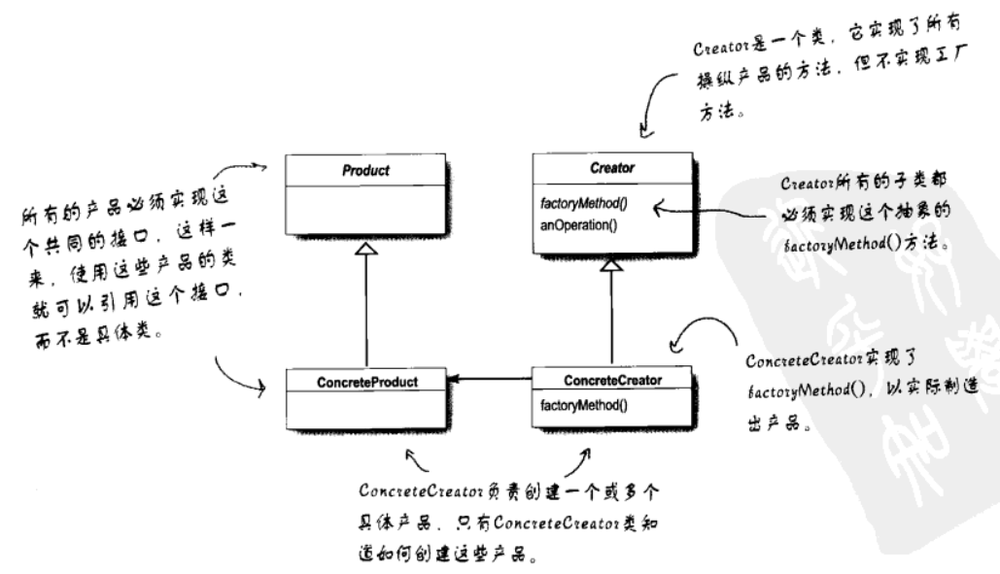

根据GOF四人组对设计模式的总结划分，设计模式分为三大类：

**创建型**

涉及到对象实例化，这类模式都提供一个方法，将客户从所需要实例化的对象中解耦

**结构型**

可以让你把类或者对象组合到更大的结构中

**行为型**

涉及到类和对象如何交互及分配职责


## 设计原则

- 找出应用中可能需要变化之处，把它们独立出来，不要和那边不需要变化的代码混合在一次
- 针对接口编程，而不是针对实现编程
- 多用组合，少用继承
- 为了交互对象之间的松耦合设计而努力
- 类应该对扩展开放，对修改关闭
- 要依赖抽象，而不是具体类
- 最少知识原则，只和你的密友谈话
- 别调用（打电话给）我们，我们会调用（打电话给）你
- 一个类应该只有一个引起变化的原因


#### **MVC**

**一个符合模式**：模式 - 视图 - 控制器模式（MVC）把应用分成截然不同的三个组件：模型、视图、控制器

结构：


## **创建型**

#### 简单工厂

**不是一个真正的模式**：但是和抽象工厂和工厂方法模式一样，它经常被用于封装创建对象的代码

```c#
Pizaa orderPizza(string type)
{
    Pizza pizza;
    pizza = factory.createpizza(type); // 调用
    pizza.prepare();
    pizza.bake();
    pizza.cut();
    pizza.box();
    reture pizza;
}
```

```c#
if(type.equals("cheese")) // 产品
{
    pizza = new CheesePizza();
}
else if(type.equals("pepperoni"))
{
    pizza = new PepperoniPizza();
}
else if(type.equals("clam"))
{
    pizza = new ClamPizza();
}
else if(type.equals("veggie"))
{
    pizza = new VeggiePizza();
}
```


#### **工厂方法（Factory Method）**

定义了一个创建对象接口，由子类决定实例化类是哪一个。工厂方法将类的实例化推迟到了子类

结构：



#### **抽象工厂（Abstract Factory）**

描述：

提供一个接口，用于创建相关或依赖对象的家族，而无需明确指定具体类。

结构：


#### 建造者模式

描述：

将一个复杂对象的构建和表示分离，使得同样的建造过程可以创建不同的表示。

结构：


#### 原型模式

描述：
用原型实例指定创建对象的种类，并通过这些原型创建新的对象。
使用：
当创建给定类的实例过程很昂贵或很复杂时，就使用原型模式。

结构：


#### 单例模式（Singleton）

描述：
保证一个类只有一个实例，并提供一个它的全局访问点。

结构：


## 结构型

#### 适配器模式（Adapter）

描述：
将一个类的接口转换为客户希望的另一个接口，使原来接口不兼容的类一起使用。
使用：
适配器和期望的类实现同一个接口，同时适配器持有需被适配的类引用，这样就可以完成类的适配。

结构：


#### 桥接模式

描述：
使抽象部分和实现部分分离，使它们可以独立的变化。
使用：
抽象类持有目标实现类接口的引用，通过动态修改具体实现类的引用来实现功能。

结构：


#### 组合模式（Composite）

描述：
将对象组合成树状结构，以表示“部分-整体”的层次结构，组合模式使得用户对单个对象和组合对象的使用具有一致性。

结构：


##### 优点

- 定义层次 : 清楚地 定义 分层次 的 复杂对象 , 表示 对象 的 全部 或 部分 层次 ;
- 忽略层次 : 让 客户端 忽略 层次之间的差异 , 方便对 整个层次结构 进行控制 ;
- 简化客户端代码 ;
- 符合开闭原则 ;

##### 缺点

- 限制类型复杂 : 限制类型时 , 比较复杂 ;
  如 : 某个目录中只能包含文本文件 , 使用组合模式时 , 不能依赖类型系统 , 施加约束 , 它们都来自于节点的抽象层 ; 在这种情况下 , 必须通过在运行时进行类型检查 , 这样就变得比较复杂 ;
- 使设计变得更加抽象 ;

##### **意图**

- 将对象组合成树形结构以表示"部分-整体"的层次结构。组合模式使得用户对单个对象和组合对象的使用具有一致性。

##### **主要解决**

- 它在我们树型结构的问题中，模糊了简单元素和复杂元素的概念，客户程序可以像处理简单元素一样来处理复杂元素，从而使得客户程序与复杂元素的内部结构解耦。

##### **何时使用**

- 想表示对象的部分-整体层次结构（树形结构）。 
- 希望用户忽略组合对象与单个对象的不同，用户将统一地使用组合结构中的所有对象。

##### 如何解决

- 树枝和叶子实现统一接口，树枝内部组合该接口。

##### 关键代码

- 树枝内部组合该接口，并且含有内部属性 List，里面放 Component。

##### 使用场景

- 部分、整体场景，如树形菜单，文件、文件夹的管理。

##### 代码示例

```c#
public abstract class Component
{
    protected string _name;
    public Component(string name)
    {
        this._name = name;
    }

    public abstract void Add(Component c);
    public abstract void Remove(Component c);
    public abstract void Display(int depth);
}
```

```C#
public class Leaf : Component
{
    public Leaf(string name): base(name)
    {
    }

    public override void Add(Component c)
    {
        Console.WriteLine("Cannot add to a leaf");
    }
    public override void Remove(Component c)
    {
        Console.WriteLine("Cannot remove from a leaf");
    }
    public override void Display(int depth)
    {
        Console.WriteLine(new String('-', depth) + _name);
    }
}
```

```c#
public class Composite : Component // 组合
{
    private List<Component> _children = new List<Component>();

    public Composite(string name): base(name)
    {
    }

    public override void Add(Component component)
    {
        _children.Add(component);
    }
    public override void Remove(Component component)
    {
        _children.Remove(component);
    }
    public override void Display(int depth)
    {
        Console.WriteLine(new String('-', depth) + _name);

        foreach (Component component in _children)
        {
            component.Display(depth + 2);
        }
    }
}
```

```c#
public class Client
{
    static void Main(string[] args)
    {
        // 创建树结构
        Composite root = new Composite("root");
        root.Add(new Leaf("Leaf A")); // Leaf 继承 Component
        root.Add(new Leaf("Leaf B"));

        Composite comp = new Composite("Composite X");
        comp.Add(new Leaf("Leaf XA"));
        comp.Add(new Leaf("Leaf XB"));

        root.Add(comp);
        root.Add(new Leaf("Leaf C"));

        // 添加和删除叶节点
        Leaf leaf = new Leaf("Leaf D");
        root.Add(leaf);
        root.Remove(leaf);

        root.Display(1); // 递归显示树
    }
}
```

```c#
结果显示：
-root
---Leaf A
---Leaf B
---Composite X
-----Leaf XA
-----Leaf XB
---Leaf C
```


#### **装饰者（Decorator）**

描述：
动态给对象添加一些额外的行为。若要扩展功能，装饰者模式比继承更具有弹性。

结构：


#### 外观模式（Facade）

描述：
定义了一个高层的接口，为子系统的一组接口提供了一个一致的界面，使得子系统更容易使用。

结构：


##### 模式特点

- 通过引入一个新的外观角色来降低原有系统的复杂度，同时降低客户类与子系统的耦合度（所指的子系统是一个广义的概念，它可以是一个类、一个功能模块、系统的一个组成部分或者一个完整的系统），使得子系统更加易用
- 它实现了子系统与客户端之间的松耦合关系，这使得子系统的变化不会影响到调用它的客户端，只需要调整外观类即可
- 一个子系统的修改对其他子系统没有任何影响，而且子系统的内部变化也不会影响到外观对象

##### 模式缺点

- **不能很好地限制客户端直接使用子系统类**，如果对客户端访问子系统类做太多的限制则减少了可变性和灵活性
- 如果设计不当，增加新的子系统可能需要**修改外观类的源代码，违背了开闭原则**

##### 使用情景

- 要为访问一系列复杂的子系统提供一个简单入口
- 客户端程序与多个子系统之间存在很大的依赖性
- 在层次化结构中，可以使用外观模式定义系统中每一层的入口，层与层之间不直接产生联系，而是通过外观类建立联系，降低层之间的耦合度

##### 延申及拓展

- 一个系统有**多个外观类**，这是一件很正常的事情，而且外观类通常也只有一个实例，所以也可以为了节约资源而设置成**单例类**
- **不要通过继承一个外观类在子系统中加入新的行为，这种做法是错误的**，外观模式的本意就是为子系统提供一个集中化和简化的沟通渠道，而不是向子系统加入新的行为，若需要修改原有子系统类或增加新的子系统类来实现

##### 代码实现

1. 首先设计子系统

   ```C#
   public class Light  //子系统Light
   {
   	private Srtring position;
   	public Light(String postion){
   		this.position = position;
   	}
   	public void on(){
   		System.out.println(this.positioin + "灯打开！");
   	}
   	public void off(){
   		System.out.println(this.positioin + "灯关闭！");
   	}
   }
   
   public class Fan //子系统Fan
   {
   	public void on(){
   		System.out.println(this.positioin + "风扇打开！");
   	}
   	public void off(){
   		System.out.println(this.positioin + "风扇关闭！");
   	}
   }
   
   public class AirCondition //子系统AirCondition
   {
   	public void on(){
   		System.out.println(this.positioin + "空调打开！");
   	}
   	public void off(){
   		System.out.println(this.positioin + "空调关闭！");
   	}
   }
   
   public class TV //子系统TV
   {
   	public void on(){
   		System.out.println(this.positioin + "电视打开！");
   	}
   	public void off(){
   		System.out.println(this.positioin + "电视关闭！");
   	}
   }
   ```

2. 外观类统一管理

   ```c#
   public interface GeneralSwitchFacade //外观类GeneralSwitchFacade
   {
   	private Light lights[] = new Light[4];
   	private Fan fan;
   	private AirCondition ac;
   	private TV tv;
   	
   	public GeneralSwitchFacade()
   	{
   		lights[0] = new Light("左前");
   		lights[1] = new Light("右前");
   		lights[2] = new Light("左后");
   		lights[3] = new Light("右后");
   		fan = new Fan();
   		ac = new AirCondition();
   	}
   	public void on() {
   		lights[0].on();
   		lights[1].on();
   		lights[2].on();
   		lights[3].on();
   		fan.on();
   		ac.on();
   		tv.on();
   	}
   	public void off() {
   		lights[0].off();
   		lights[1].off();
   		lights[2].off();
   		lights[3].off();
   		fan.off();
   		ac.off();
   		tv.off();
   	}
   }
   ```

3. 客户端的代码

```c#
public class Client
{
	public static void main(String args[])
	{
         GeneralSwitchFacade gsf = new GeneralSwitchFacade();
         gsf.on();
         gsf.off();
	}
}

```

客户端代码非常简洁，子系统的各类交互逻辑都封装在外观类，客户只需要对接好封装的on方法和off方法

#### 享元模式

描述：
运用共享技术有效的支持大粒度对象。

结构：


#### 代理模式（Proxy）

描述：
为其他对象提供代理以控制这个对象的访问。

结构：


## 行为型

#### **观察者（Observer）**

描述：
定义对象间一种一对多的对象依赖关系，当对象发生改变时，所有依赖他的对象收到通知并自动更新。

结构：


#### 模板方法（Template Method）

描述：
在一个方法中定义一个算法的骨架，将一些步骤延迟到子类中。模板方法可以使得子类在不改变算法结构情况下，重新定义算法中的某些步骤实现。

结构：


#### 命令模式（Command）

描述：
将请求封装成对象，以便使用请求、队列或者日志来参数化其他对象。命令模式也支持撤销操作。

结构：


#### 状态模式（State）

描述：
允许对象在内部状态改变时改变它的行为，对象看起来好像修改了它的类。

结构：


#### 责任链模式

描述：
使多个对象都有机会处理请求，从而避免了请求的发送者和接收者之间耦合。将这些对象连成一条链，并沿着这条链传递请求，直到有一个对象处理为止。

结构：


#### 解释器模式

描述：
给定一个语言，定义它的文法的一种表示，并定义一个解释器，这个解释器使用该表示来解释语言中的句子。

结构：


#### 中介者模式

描述：
用一个中介对象来封装一系列对象的交互。中介者模式使各对象之间不需要显示地互相引用，从而使其耦合松散，而且可以独立地改变它们之间的交互。

结构：


#### 访问者模式

描述：
允许你对组合结构加入新的操作，而无需改变结构本身。
使用：
当你想要为一个对象的组合增加新的能力，且封装并不重要时，就使用访问者模式。因为会打破组合类的封装。

结构：


#### **策略（Strategy）**

描述：
定义了算法簇，分别封装起来，让他们之间可以互相替换，此模式让算法的变化独立于使用算法的客户。

结构：


#### 备忘录模式

描述：
在不破坏封装的前提下，捕获对象的内部状态，并在该对象外保存这个状态。这样可以让对象恢复到保存的状态。

结构：


#### 迭代器模式（Iterator）

描述：
提供一种方法顺序访问聚合对象中的各个元素，而不需要暴露该对象的内部表示。

结构：


## 其他

#### 工厂方法与抽象工厂的区别联系

| 工厂方法模式                               | 抽象工厂模式                               |
| :----------------------------------------- | :----------------------------------------- |
| 针对的是单个产品等级结构                   | 针对的是面向多个产品等级结构               |
| 一个抽象产品类                             | 多个抽象产品类                             |
| 可以派生出多个具体产品类                   | 每个抽象产品类可以派生出多个具体产品类     |
| 一个抽象工厂类，可以派生出多个具体工厂类   | 一个抽象工厂类，可以派生出多个具体工厂类   |
| 每个具体工厂类只能创建一个具体产品类的实例 | 每个具体工厂类可以创建多个具体产品类的实例 |

