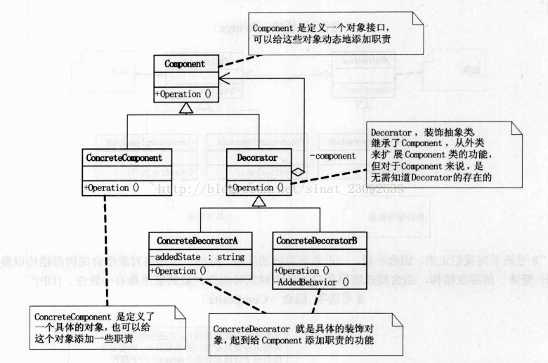
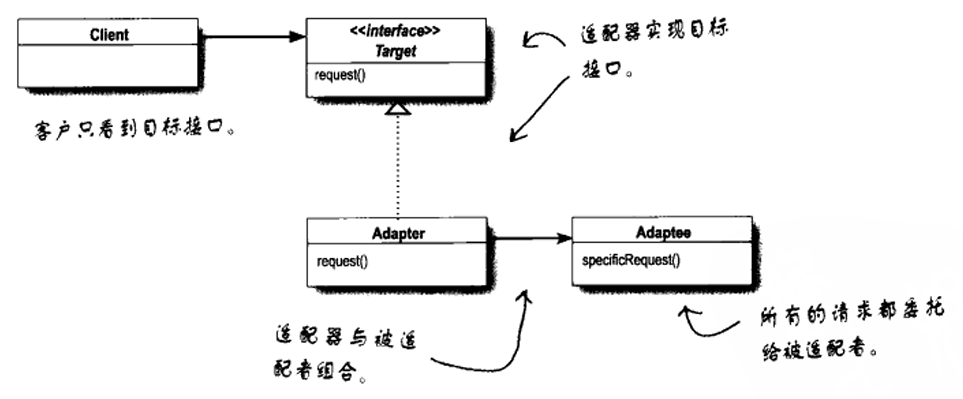
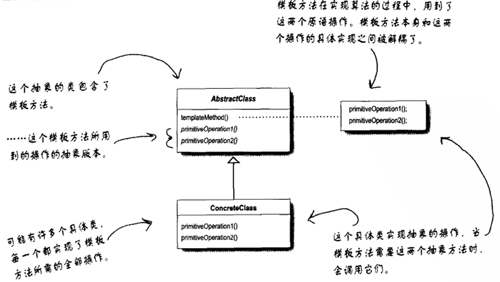
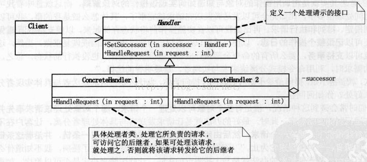
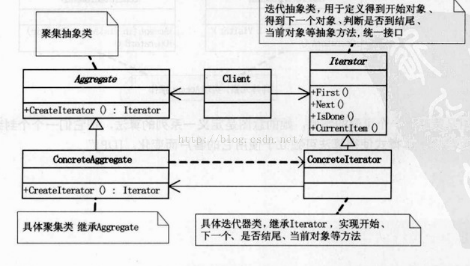

#### **MVC**

业务逻辑、数据、界面显示分离的方法

- Model（模型）：**处理应用程序数据逻辑的部分**
- View（视图）：**处理数据显示的部分**
- Controller（控制器）：**用户交互的部分**


------

#### **策略（Strategy）**

> 定义了算法簇，分别封装起来，让他们之间可以互相替换，此模式让算法的变化独立于使用算法的客户。
> 多用组合，少用继承
> 鸭子的行为=飞的行为+叫的行为+...
> 每当有新的鸭子子类出现，都要被迫检查并可能覆盖fly()和quack()...

- 同一功能有多个实现版本
- 算法需要频繁增删改
- 算法包含敏感数据需要隔离
- 系统存在多重条件分支判断
- 需要提高代码的灵活性和扩展性


##### 示例

```C#
using System;

public interface IStrategy // 1. 定义策略接口
{
    void Execute();
}

public class ConcreteStrategyA : IStrategy // 2. 具体策略实现
{
    public void Execute(){
        Console.WriteLine("使用策略A执行");
    }
}

public class ConcreteStrategyB : IStrategy // 2. 具体策略实现
{
    public void Execute(){
        Console.WriteLine("使用策略B执行");
    }
}

public class Context // 3. 上下文类
{
    private IStrategy _strategy;

    public Context(IStrategy strategy){ // 通过构造函数注入策略
        _strategy = strategy;
    }

    public void ExecuteStrategy(){
        _strategy.Execute();
    }
}

class Program // 4. 使用示例
{
    static void Main(string[] args){
        // 使用策略A
        var context = new Context(new ConcreteStrategyA());
        context.ExecuteStrategy();  // 输出：使用策略A执行

        // 切换为策略B
        context = new Context(new ConcreteStrategyB());
        context.ExecuteStrategy();  // 输出：使用策略B执行
    }
}
```

------

#### **观察者（Observer）**

> 定义对象间一种一对多的对象依赖关系，当对象发生改变时，所有依赖他的对象收到通知并自动更新。
>
> - 在观察者模式中，会改变的是主题的状态，以及观察者的数量和类型，用这个模式你可以改变依赖于主题状态的对象，而不必改变主题。
> - 主题与观察者都使用接口，观察者是利用主题的接口向主题注册，而主题利用观察者接口通知观察者。运行正常且松耦合
> - 观察者模式利用组合将许多观察者组合进主题中，对象之间这种关系不是通过继承产生的，而是在运行时利用组合的方式产生

- GUI事件处理系统
- 实时数据监控（股票行情、物联网传感器）
- 消息推送系统
- MVC模式中的模型-视图通信


##### 示例

```c#
using System;
using System.Collections.Generic;

public interface ISubject // 1. 主题（被观察者）接口
{
    void RegisterObserver(IObserver observer); //注册观察者
    void RemoveObserver(IObserver observer); //移除观察者
    void NotifyObservers(); //移除观察者
}

public interface IObserver // 2. 观察者接口
{
    void Update(string message); // 接收更新的方法
}

public class WeatherStation : ISubject // 3. 具体主题实现（气象站）
{
    private List<IObserver> _observers = new List<IObserver>(); //维护观察者列表
    private string _weatherData;

    public void RegisterObserver(IObserver observer){
        _observers.Add(observer);
    }

    public void RemoveObserver(IObserver observer){
        _observers.Remove(observer);
    }

    public void NotifyObservers(){
        foreach (var observer in _observers){
            observer.Update(_weatherData);
        }
    }

    public void SetWeather(string newWeather){ //在天气数据变化时触发通知
        _weatherData = newWeather;
        NotifyObservers(); // 数据变化时自动通知观察者
    }
}

public class PhoneDisplay : IObserver // 4. 具体观察者实现（手机显示屏）
{
    public void Update(string message){
        Console.WriteLine($"手机显示：当前天气 - {message}");
    }
}

public class WindowDisplay : IObserver // 4. 具体观察者实现（窗口显示屏）
{
    public void Update(string message){
        Console.WriteLine($"窗口显示：天气更新 - {message}");
    }
}

class Program // 使用示例
{
    static void Main(string[] args){
        var weatherStation = new WeatherStation();
        
        var phoneDisplay = new PhoneDisplay();
        var windowDisplay = new WindowDisplay();

        weatherStation.RegisterObserver(phoneDisplay);// 注册观察者
        weatherStation.RegisterObserver(windowDisplay);// 注册观察者

        weatherStation.SetWeather("晴，25℃"); // 更新天气数据（自动触发通知）
        /* 输出：
           手机显示：当前天气 - 晴，25℃
           窗口显示：天气更新 - 晴，25℃
        */

        weatherStation.RemoveObserver(windowDisplay); // 移除一个观察者

        // 再次更新
        weatherStation.SetWeather("多云，23℃");
        /* 输出：
           手机显示：当前天气 - 多云，23℃
        */
    }
}
```

------

#### **装饰者（Decorator）**

> 核心目的是**动态地为对象添加额外的职责**，同时保持接口的一致性。若要扩展功能，装饰者模式比继承更具有弹性。
>
> - 装饰者和被装饰者必须是一样的类型，也就是有共同的超类（Beverage），利用继承达到“类型匹配”，而不是利用继承获得“行为”
> - 通常装饰者模式采用抽象类
> - 如果需要针对特定的具体组件编程，就应该重新思考你的应用架构，以及装饰者是否合适
> - 装饰者该做的事情，就是增加行为到包装对象上

- 装饰者模式意味着一群装饰者类，这些类用来包装具体组件、
- 装饰者类反映出被装饰的组件类型(事实上，他们具有相同的类型，都经过接口或继承实现)
- 装饰者可以在被装饰者的行为前面与/或后面加上自己的行为，甚至将被装饰者的行为整个取代掉，而达到特定的目的
- 可以用无数个装饰者包装个组件
- 装饰者一般对组件的客户是透明的，除非客户程序依赖于组件的具体类型。装饰者模式通过保持接口一致性来对客户端透明，但如果客户端依赖于具体类型，这种透明性就会被破坏，装饰者可能需要做额外处理，或者客户端需要调整代码
- 装饰者会导致设计中出现许多小对象，如果过度使用，会让程序变得很复杂




##### 示例

```C#
using System;

public interface IBeverage // 基础组件接口（饮料） Component对象接口
{
    string GetDescription();
    decimal GetCost();
}

public class BlackCoffee : IBeverage // 具体组件（黑咖啡） ConcreteComponent具体对象
{
    public string GetDescription() => "黑咖啡";
    public decimal GetCost() => 10m;
}

public abstract class BeverageDecorator : IBeverage // Decorator装饰者抽象类
{
    protected IBeverage _beverage;

    protected BeverageDecorator(IBeverage beverage){
        _beverage = beverage;
    }

    public virtual string GetDescription() => _beverage.GetDescription();
    public virtual decimal GetCost() => _beverage.GetCost();
}

public class MilkDecorator : BeverageDecorator //ConcreteDecoratorA（加牛奶）
{
    public MilkDecorator(IBeverage beverage) : base(beverage) { }

    public override string GetDescription() => 
        _beverage.GetDescription() + " + 牛奶";

    public override decimal GetCost() => 
        _beverage.GetCost() + 3m;
}

public class SugarDecorator : BeverageDecorator // 具体装饰者B（加糖）
{
    public SugarDecorator(IBeverage beverage) : base(beverage) { }

    public override string GetDescription() => 
        _beverage.GetDescription() + " + 糖";

    public override decimal GetCost() => 
        _beverage.GetCost() + 1m;
}


class Program // 使用示例
{
    static void Main(string[] args)
    {
        IBeverage coffee = new BlackCoffee(); // 基础黑咖啡
        Console.WriteLine($"{coffee.GetDescription()} 价格：{coffee.GetCost()}元");

        coffee = new MilkDecorator(coffee); // 加牛奶
        Console.WriteLine($"{coffee.GetDescription()} 价格：{coffee.GetCost()}元");

        coffee = new SugarDecorator(coffee); // 加糖
        Console.WriteLine($"{coffee.GetDescription()} 价格：{coffee.GetCost()}元");

        IBeverage complexCoffee = new SugarDecorator(new MilkDecorator(new BlackCoffee())); // 组合添加方式
        Console.WriteLine($"{complexCoffee.GetDescription()} 价格：{complexCoffee.GetCost()}元");
    }
}

/* 输出：
黑咖啡 价格：10元
黑咖啡 + 牛奶 价格：13元
黑咖啡 + 牛奶 + 糖 价格：14元
黑咖啡 + 牛奶 + 糖 价格：14元
*/
```

------

#### 简单工厂

**不是一个真正的模式**：但是和抽象工厂和工厂方法模式一样，它经常被用于封装创建对象的代码。通过一个工厂类来封装对象的创建逻辑

```c#
Pizaa orderPizza(string type)
{
    Pizza pizza;
    pizza = factory.createpizza(type); // 调用
    pizza.prepare();
    pizza.bake();
    pizza.cut();
    pizza.box();
    reture pizza;
}
```

```c#
if(type.equals("cheese")) // 产品
{
    pizza = new CheesePizza();
}
else if(type.equals("pepperoni"))
{
    pizza = new PepperoniPizza();
}
else if(type.equals("clam"))
{
    pizza = new ClamPizza();
}
else if(type.equals("veggie"))
{
    pizza = new VeggiePizza();
}
```

------

#### **工厂方法（Factory Method）**

> 用来处理对象的创建，并将这样的行为封装在子类中
>
> 定义了一个创建对象接口，由子类决定实例化类是哪一个。工厂方法将类的实例化推迟到了子类


##### 示例1

```c#
public interface IProduct { // 产品接口
    void CreatePizza();
}

class ConcreteProductA : IProduct { // 具体产品A
    public void CreatePizza() => Console.WriteLine("纽约风味披萨");
}

class ConcreteProductB : IProduct{ // 具体产品B
    public void CreatePizza() => Console.WriteLine("芝加哥风味披萨");
}

public abstract class Creator{ // 工厂接口
    public abstract IProduct Factorymethod();
}

public class NYPizzaConcreteCreator : Creator{ // 具体工厂
    public override IProduct Factorymethod() => new ConcreteProductA();
}

public class ChicagoPizzaConcreteCreator : Creator{ // 具体工厂
    public override IProduct Factorymethod() => new ConcreteProductB();
}

class Program { // 使用
    static void Main(){
        ICreatorFactory NYPizzaFactory = new NYPizzaConcreteFactory();
        IProduct NYPizza = NYPizzaFactory.CreatePizza();
        NYPizza.CreatePizza(); // 输出：纽约风味披萨

        ICreatorFactory ChicagoPizzaFactory = new ChicagoPizzaConcreteFactory();
        IProduct ChicagoPizza = ChicagoPizzaFactory.CreatePizza();
        ChicagoPizza.CreatePizza(); // 输出：芝加哥风味披萨
    }
}
```

##### 示例2

```c#
using System;

public interface IButton // 产品接口
{
    void Render();
    void OnClick();
}

class WindowsButton : IButton // 具体产品
{
    public void Render() => Console.WriteLine("渲染Windows风格按钮");
    public void OnClick() => Console.WriteLine("Windows按钮点击事件");
}

class WebButton : IButton // 具体产品
{
    public void Render() => Console.WriteLine("渲染HTML网页按钮");
    public void OnClick() => Console.WriteLine("Web按钮点击事件");
}

public abstract class Dialog // 创建者抽象类
{
    public abstract IButton CreateButton(); // 工厂方法（核心）

    public void Render() // 业务逻辑方法
    {
        Console.WriteLine("--- 开始渲染对话框 ---");
        IButton button = CreateButton();
        button.Render();
        button.OnClick();
        Console.WriteLine("--- 渲染完成 ---\n");
    }
}

class WindowsDialog : Dialog{ // 具体创建者
    public override IButton CreateButton() => new WindowsButton();
}

class WebDialog : Dialog{ // 具体创建者
    public override IButton CreateButton() => new WebButton();
}

class Program // 客户端
{
    static void Main()
    {
        Dialog windowsDialog = new WindowsDialog();
        windowsDialog.Render();
        // 输出：
        // --- 开始渲染对话框 ---
        // 渲染Windows风格按钮
        // Windows按钮点击事件
        // --- 渲染完成 ---

        Dialog webDialog = new WebDialog();
        webDialog.Render();
        // 输出：
        // --- 开始渲染对话框 ---
        // 渲染HTML网页按钮
        // Web按钮点击事件
        // --- 渲染完成 ---
    }
}
```

------

#### **抽象工厂（Abstract Factory）**

> 提供一个接口，用于创建相关或依赖对象的家族，而无需明确指定具体类。
>
> 抽象工厂允许客户使用抽象的接口来创建一组相关的产品，而不需要知道(或关心)实际产出的具体产品是什么


##### 示例

```c#
public interface IButton{ // 抽象产品族
    void Render();
}

public interface ITextBox{ // 抽象产品族
    void Input();
}

class WindowsButton : IButton { // 具体产品（Windows系列）
    public void Render() => Console.WriteLine("渲染Windows风格按钮");
}

class WindowsTextBox : ITextBox{ // 具体产品（Windows系列）
    public void Input() => Console.WriteLine("Windows文本框输入");
}

class WebButton : IButton{ // 具体产品（Web系列）
    public void Render() => Console.WriteLine("渲染HTML网页按钮");
}

class WebTextBox : ITextBox{ // 具体产品（Web系列）
    public void Input() => Console.WriteLine("网页表单输入");
}

public interface IUIFactory{ // 抽象工厂
    IButton CreateButton();
    ITextBox CreateTextBox();
}

class WindowsUIFactory : IUIFactory // 具体工厂（Windows系列）
{
    public IButton CreateButton() => new WindowsButton();
    public ITextBox CreateTextBox() => new WindowsTextBox();
}

class WebUIFactory : IUIFactory{ // 具体工厂（Web系列）
    public IButton CreateButton() => new WebButton();
    public ITextBox CreateTextBox() => new WebTextBox();
}


class Program { // 使用
    static void Main(){
        // 创建Windows风格UI组件
        IUIFactory windowsFactory = new WindowsUIFactory();
        windowsFactory.CreateButton().Render();  // 输出：渲染Windows风格按钮
        windowsFactory.CreateTextBox().Input();  // 输出：Windows文本框输入

        // 创建Web风格UI组件
        IUIFactory webFactory = new WebUIFactory();
        webFactory.CreateButton().Render();      // 输出：渲染HTML网页按钮
        webFactory.CreateTextBox().Input();     // 输出：网页表单输入
    }
}
```

------

#### 单例模式（Singleton）

> 保证一个类只有一个实例，并提供一个它的全局访问点。
>
> 如果将对象赋值给一个全局变量，必须在程序一开始就创建好对象。利用单例模式，可以在需要时才创建对象

|   **对比维度**   |             **单例类**             |             **静态类**             |
| :--------------: | :--------------------------------: | :--------------------------------: |
|    **实例化**    |        有且仅有一个对象实例        |      无实例，直接通过类名调用      |
|   **内存管理**   |      占用对象内存（可GC回收）      |        无对象内存，常驻内存        |
|   **多态支持**   |       ✅ 可实现接口、继承父类       |        ❌ 无法继承或实现接口        |
|   **状态管理**   |   ✅ 封装实例状态（如连接池计数）   |   ❌ 只能通过静态变量维护全局状态   |
|   **线程安全**   | 需自行控制（如用`lock`/`Lazy<T>`） |    ✅ 天然线程安全（无实例状态）    |
|   **依赖注入**   |       ✅ 支持（作为服务注入）       |             ❌ 无法注入             |
|  **测试友好性**  |            ✅ 可Mock替换            |           ❌ 难以隔离测试           |
|  **初始化时机**  |           支持延迟初始化           |         类加载时自动初始化         |
|    **序列化**    |               ✅ 支持               |              ❌ 不支持              |
| **典型应用场景** |  有状态服务（日志、配置、连接池）  | 无状态工具类（数学计算、扩展方法） |


##### 示例1：线程安全懒汉式

```C#
public sealed class Singleton
{
    private static Singleton _instance; // 实例引用
    private static readonly object _lock = new object(); // 锁对象

    private Singleton(){ } // 私有构造函数,防止外部实例化

    public static Singleton Instance{ // 全局访问点
        get{
            if (_instance == null){ // 第一次检查（避免不必要的锁）
                lock (_lock) {
                    if (_instance == null){ // 第二次检查（防止多线程重复创建）
                        _instance = new Singleton();
                    }
                }
            }
            return _instance;
        }
    }

    public void Log(string message){ // 示例方法
        Console.WriteLine($"[Singleton] {DateTime.Now}: {message}");
    }
}


class Program { // 使用示例
    static void Main(){
        Singleton.Instance.Log("Application started"); // 输出示例：[Singleton] 2023-10-05 10:00:00: Application started
    }
}
```

##### 示例2：饿汉式

```c#
public sealed class EagerSingleton
{
    private static readonly EagerSingleton _instance = new EagerSingleton(); // 类加载时立即初始化

    static EagerSingleton() { }
    private EagerSingleton() { }

    public static EagerSingleton Instance => _instance;
}
```

##### 示例3：使用 Lazy

```c#
public sealed class LazySingleton{
    // 线程安全的延迟初始化
    private static readonly Lazy<LazySingleton> _lazyInstance = new Lazy<LazySingleton>(() => new LazySingleton());

    public static LazySingleton Instance => _lazyInstance.Value;

    private LazySingleton() { }

    public void ShowHashCode(){
        Console.WriteLine($"Instance Hash: {this.GetHashCode()}");
    }
}

class Program{ // 验证单例
    static void Main(){
        var instance1 = LazySingleton.Instance;
        var instance2 = LazySingleton.Instance;
        
        instance1.ShowHashCode(); // 输出相同的哈希值
        instance2.ShowHashCode(); // 输出相同的哈希值
    }
}
```

------

#### 命令模式（Command）

> 将请求封装成对象，以便使用请求、队列或者日志来参数化其他对象。命令模式也支持撤销操作。
>


##### 示例

```c#
public interface ICommand{ // 命令接口Command
    void Execute();
}

public class TurnOnLightCommand : ICommand{ // 具体命令ConcreteCommand
    private Light _light;
    public TurnOnLightCommand(Light light) {_light = light;}
    public void Execute() => _light.TurnOn();
}

public class TurnOffLightCommand : ICommand{ // 具体命令ConcreteCommand
    private Light _light;
    public TurnOffLightCommand(Light light){_light = light;}
    public void Execute() => _light.TurnOff();
}

public class Light{ // 接收者（实际执行操作的对象） Receiver
    public void TurnOn() => Console.WriteLine("💡 灯光已打开"); //Action
    public void TurnOff() => Console.WriteLine("🌑 灯光已关闭");//Action
}

public class RemoteControl // 调用者（触发命令的对象）Invoker
{
    private ICommand _command;
    public void SetCommand(ICommand command){_command = command;}
    public void PressButton(){_command?.Execute();} // Invoke
}

class Program{ // Client
    static void Main(string[] args){
        // Client创建接收者和命令
        var light = new Light(); //Receiver
        var command = new TurnOnLightCommand(light);// ConcreteCommand
        // Client将命令设置给调用者
        var remote = new RemoteControl(); // Invoker
        remote.SetCommand(command);
        remote.PressButton(); // 调用Command.Execute()触发执行  输出：💡 灯光已打开

        // 设置并执行关灯命令
        remote.SetCommand(new TurnOffLightCommand(light));
        remote.PressButton();  // 输出：🌑 灯光已关闭
    }
}
```

------

#### 适配器模式（Adapter）

> 将一个类的接口转换为客户期望的另一个接口，适配器让原本接口不兼容的类可以合作无间。
> 适配器和期望的类实现同一个接口，同时适配器持有需被适配的类引用，这样就可以完成类的适配。

对象适配器



类适配器（多重继承，无法在C#中这么做）


##### 示例

```c#
//------------------- 旧版日志接口（需要被适配的对象） -------------------
public interface ILogger{
    void WriteLog(string message);
}

// 旧版文件日志实现类
public class FileLogger : ILogger
{
    public void WriteLog(string message){
        Console.WriteLine($"[File Log] {message}");
    }
}

//------------------- 新版云日志接口（目标接口） -------------------
public interface ICloudLogger{
    void Log(string content, int severity);
}

//------------------- 适配器类（核心） -------------------
public class LoggerAdapter : ICloudLogger{
    private readonly ILogger _oldLogger;

    // 通过构造函数注入旧版日志对象
    public LoggerAdapter(ILogger oldLogger){
        _oldLogger = oldLogger;
    }

    // 将新接口方法适配到旧接口
    public void Log(string content, int severity){
        // 转换参数格式（例如添加日志级别标识）
        var formattedMessage = $"(Severity:{severity}) {content}";
        _oldLogger.WriteLog(formattedMessage);
    }
}

//------------------- 客户端调用示例 -------------------
class Program{
    static void Main(){
        // 现有旧系统使用的文件日志
        ILogger fileLogger = new FileLogger();       
        // 创建适配器，让旧日志支持新接口
        ICloudLogger cloudLogger = new LoggerAdapter(fileLogger); 
        // 通过新接口调用旧功能
        cloudLogger.Log("User login successful", 1);
        cloudLogger.Log("Payment failed", 3);
    }
}
```

------

#### 外观模式（Facade）

> 提供了一个统一的接口，用来访问在系统中的一群接口。外观定义了一个高层接口，让子系统更容易使用。
>


##### 模式特点

- 通过引入一个新的外观角色来降低原有系统的复杂度，同时降低客户类与子系统的耦合度（所指的子系统是一个广义的概念，它可以是一个类、一个功能模块、系统的一个组成部分或者一个完整的系统），使得子系统更加易用
- 它实现了子系统与客户端之间的松耦合关系，这使得子系统的变化不会影响到调用它的客户端，只需要调整外观类即可
- 一个子系统的修改对其他子系统没有任何影响，而且子系统的内部变化也不会影响到外观对象

##### 模式缺点

- **不能很好地限制客户端直接使用子系统类**，如果对客户端访问子系统类做太多的限制则减少了可变性和灵活性
- 如果设计不当，增加新的子系统可能需要**修改外观类的源代码，违背了开闭原则**

##### 使用情景

- 要为访问一系列复杂的子系统提供一个简单入口
- 客户端程序与多个子系统之间存在很大的依赖性
- 在层次化结构中，可以使用外观模式定义系统中每一层的入口，层与层之间不直接产生联系，而是通过外观类建立联系，降低层之间的耦合度

##### 延申及拓展

- 一个系统有**多个外观类**，这是一件很正常的事情，而且外观类通常也只有一个实例，所以也可以为了节约资源而设置成**单例类**
- **不要通过继承一个外观类在子系统中加入新的行为，这种做法是错误的**，外观模式的本意就是为子系统提供一个集中化和简化的沟通渠道，而不是向子系统加入新的行为，若需要修改原有子系统类或增加新的子系统类来实现

##### 代码实现

1. 首先设计子系统

   ```C#
   public class Light  //子系统Light
   {
   	private Srtring position;
   	public Light(String postion){
   		this.position = position;
   	}
   	public void on(){
   		System.out.println(this.positioin + "灯打开！");
   	}
   	public void off(){
   		System.out.println(this.positioin + "灯关闭！");
   	}
   }
   
   public class Fan //子系统Fan
   {
   	public void on(){
   		System.out.println(this.positioin + "风扇打开！");
   	}
   	public void off(){
   		System.out.println(this.positioin + "风扇关闭！");
   	}
   }
   
   public class AirCondition //子系统AirCondition
   {
   	public void on(){
   		System.out.println(this.positioin + "空调打开！");
   	}
   	public void off(){
   		System.out.println(this.positioin + "空调关闭！");
   	}
   }
   
   public class TV //子系统TV
   {
   	public void on(){
   		System.out.println(this.positioin + "电视打开！");
   	}
   	public void off(){
   		System.out.println(this.positioin + "电视关闭！");
   	}
   }
   ```

2. 外观类统一管理

   ```c#
   public interface GeneralSwitchFacade //外观类GeneralSwitchFacade
   {
   	private Light lights[] = new Light[4];
   	private Fan fan;
   	private AirCondition ac;
   	private TV tv;
   	
   	public GeneralSwitchFacade()
   	{
   		lights[0] = new Light("左前");
   		lights[1] = new Light("右前");
   		lights[2] = new Light("左后");
   		lights[3] = new Light("右后");
   		fan = new Fan();
   		ac = new AirCondition();
   	}
   	public void on() {
   		lights[0].on();
   		lights[1].on();
   		lights[2].on();
   		lights[3].on();
   		fan.on();
   		ac.on();
   		tv.on();
   	}
   	public void off() {
   		lights[0].off();
   		lights[1].off();
   		lights[2].off();
   		lights[3].off();
   		fan.off();
   		ac.off();
   		tv.off();
   	}
   }
   ```

3. 客户端的代码

```c#
public class Client
{
	public static void main(String args[])
	{
         GeneralSwitchFacade gsf = new GeneralSwitchFacade();
         gsf.on();
         gsf.off();
	}
}

```

客户端代码非常简洁，子系统的各类交互逻辑都封装在外观类，客户只需要对接好封装的on方法和off方法

------

#### 模板方法（Template Method）

描述：
在一个方法中定义一个算法的骨架，将一些步骤延迟到子类中。模板方法可以使得子类在不改变算法结构情况下，重新定义算法中的某些步骤实现。

结构：




------

#### 建造者模式

描述：

将一个复杂对象的构建和表示分离，使得同样的建造过程可以创建不同的表示。

结构：


#### 原型模式

描述：
用原型实例指定创建对象的种类，并通过这些原型创建新的对象。
使用：
当创建给定类的实例过程很昂贵或很复杂时，就使用原型模式。

结构：


#### 桥接模式

描述：
使抽象部分和实现部分分离，使它们可以独立的变化。
使用：
抽象类持有目标实现类接口的引用，通过动态修改具体实现类的引用来实现功能。

结构：


#### 组合模式（Composite）

描述：
将对象组合成树状结构，以表示“部分-整体”的层次结构，组合模式使得用户对单个对象和组合对象的使用具有一致性。

结构：


##### 优点

- 定义层次 : 清楚地 定义 分层次 的 复杂对象 , 表示 对象 的 全部 或 部分 层次 ;
- 忽略层次 : 让 客户端 忽略 层次之间的差异 , 方便对 整个层次结构 进行控制 ;
- 简化客户端代码 ;
- 符合开闭原则 ;

##### 缺点

- 限制类型复杂 : 限制类型时 , 比较复杂 ;
  如 : 某个目录中只能包含文本文件 , 使用组合模式时 , 不能依赖类型系统 , 施加约束 , 它们都来自于节点的抽象层 ; 在这种情况下 , 必须通过在运行时进行类型检查 , 这样就变得比较复杂 ;
- 使设计变得更加抽象 ;

##### **意图**

- 将对象组合成树形结构以表示"部分-整体"的层次结构。组合模式使得用户对单个对象和组合对象的使用具有一致性。

##### **主要解决**

- 它在我们树型结构的问题中，模糊了简单元素和复杂元素的概念，客户程序可以像处理简单元素一样来处理复杂元素，从而使得客户程序与复杂元素的内部结构解耦。

##### **何时使用**

- 想表示对象的部分-整体层次结构（树形结构）。 
- 希望用户忽略组合对象与单个对象的不同，用户将统一地使用组合结构中的所有对象。

##### 如何解决

- 树枝和叶子实现统一接口，树枝内部组合该接口。

##### 关键代码

- 树枝内部组合该接口，并且含有内部属性 List，里面放 Component。

##### 使用场景

- 部分、整体场景，如树形菜单，文件、文件夹的管理。

##### 代码示例

```c#
public abstract class Component
{
    protected string _name;
    public Component(string name)
    {
        this._name = name;
    }

    public abstract void Add(Component c);
    public abstract void Remove(Component c);
    public abstract void Display(int depth);
}
```

```C#
public class Leaf : Component
{
    public Leaf(string name): base(name)
    {
    }

    public override void Add(Component c)
    {
        Console.WriteLine("Cannot add to a leaf");
    }
    public override void Remove(Component c)
    {
        Console.WriteLine("Cannot remove from a leaf");
    }
    public override void Display(int depth)
    {
        Console.WriteLine(new String('-', depth) + _name);
    }
}
```

```c#
public class Composite : Component // 组合
{
    private List<Component> _children = new List<Component>();

    public Composite(string name): base(name)
    {
    }

    public override void Add(Component component)
    {
        _children.Add(component);
    }
    public override void Remove(Component component)
    {
        _children.Remove(component);
    }
    public override void Display(int depth)
    {
        Console.WriteLine(new String('-', depth) + _name);

        foreach (Component component in _children)
        {
            component.Display(depth + 2);
        }
    }
}
```

```c#
public class Client
{
    static void Main(string[] args)
    {
        // 创建树结构
        Composite root = new Composite("root");
        root.Add(new Leaf("Leaf A")); // Leaf 继承 Component
        root.Add(new Leaf("Leaf B"));

        Composite comp = new Composite("Composite X");
        comp.Add(new Leaf("Leaf XA"));
        comp.Add(new Leaf("Leaf XB"));

        root.Add(comp);
        root.Add(new Leaf("Leaf C"));

        // 添加和删除叶节点
        Leaf leaf = new Leaf("Leaf D");
        root.Add(leaf);
        root.Remove(leaf);

        root.Display(1); // 递归显示树
    }
}
```

```c#
结果显示：
-root
---Leaf A
---Leaf B
---Composite X
-----Leaf XA
-----Leaf XB
---Leaf C
```

#### 享元模式

描述：
运用共享技术有效的支持大粒度对象。

结构：


#### 代理模式（Proxy）

描述：
为其他对象提供代理以控制这个对象的访问。

结构：


#### 状态模式（State）

描述：
允许对象在内部状态改变时改变它的行为，对象看起来好像修改了它的类。

结构：


#### 责任链模式

描述：
使多个对象都有机会处理请求，从而避免了请求的发送者和接收者之间耦合。将这些对象连成一条链，并沿着这条链传递请求，直到有一个对象处理为止。

结构：



#### 解释器模式

描述：
给定一个语言，定义它的文法的一种表示，并定义一个解释器，这个解释器使用该表示来解释语言中的句子。

结构：


#### 中介者模式

描述：
用一个中介对象来封装一系列对象的交互。中介者模式使各对象之间不需要显示地互相引用，从而使其耦合松散，而且可以独立地改变它们之间的交互。

结构：


#### 访问者模式

描述：
允许你对组合结构加入新的操作，而无需改变结构本身。
使用：
当你想要为一个对象的组合增加新的能力，且封装并不重要时，就使用访问者模式。因为会打破组合类的封装。

结构：


#### 备忘录模式

描述：
在不破坏封装的前提下，捕获对象的内部状态，并在该对象外保存这个状态。这样可以让对象恢复到保存的状态。

结构：


#### 迭代器模式（Iterator）

描述：
提供一种方法顺序访问聚合对象中的各个元素，而不需要暴露该对象的内部表示。

结构：





## 其他

#### 简单工厂、工厂方法、抽象工厂

- **简单工厂**把全部的事情，在一个地方都处理完了
- 工厂方法是创建一个框架，让子类决定要如何实现
- 工厂方法使用的是类，用的方法是继承。抽象工厂使用的是对象，通过对象的组合
- 利用工厂方法创建对象需要扩展一个类，并且覆盖它的工厂方法。整个工厂方法模式，只不过是通过子类来创建对象。用这种做法，客户只需要知道他们所使用的抽象类型就可以了，而由子类来负责决定具体类型。
- 抽象工厂提供一个用来创建一个产品家族的抽象类型，这个类型的子类定义了产品被产生的方法。要使用这个工厂，必须先实例化它，然后将它传入一些针对抽象类型所写的代码中。其他优点是可以把一群相关的产品集合起来
- 抽象工厂是工厂方法的升级，包含了工厂方法，要是没有工厂方法，就没办法创建具体的产品了，也就不能叫抽象工厂了

|   **对比维度**   |   **简单工厂(Simple Factory)**    |   **工厂方法(Factory Method)**    |    **抽象工厂(Abstract Factory)**     |
| :--------------: | :-------------------------------: | :-------------------------------: | :-----------------------------------: |
|   **设计层级**   |       类级别（一个工厂类）        |      类级别（多个工厂子类）       |  类级别（多个工厂子类 + 多个产品族）  |
|   **扩展方式**   |    修改工厂类（违反开闭原则）     |   新增工厂子类（符合开闭原则）    | 新增工厂子类 + 新增产品族（符合开闭） |
|   **产品关系**   |           创建单一产品            |           创建单一产品            |      创建多个相关产品（产品族）       |
|   **核心目的**   |         封装对象创建过程          |        延迟对象创建到子类         |           保证产品族兼容性            |
|  **代码复杂度**  |               ★☆☆☆☆               |               ★★☆☆☆               |                 ★★★★☆                 |
|   **适用场景**   |  1. 简单对象创建 2. 创建逻辑固定  | 1. 需要扩展的产品 2. 多态创建需求 |  1. 跨平台/主题系统 2. 复杂对象套件   |
|   **产品维度**   |            单产品类型             |            单产品类型             |   多产品类型（按钮+文本框+菜单等）    |
|   **创建方法**   |         静态方法+条件判断         |        抽象方法由子类实现         |      多个抽象方法组合实现产品族       |
|   **开闭原则**   |          ❌ 修改已有代码           |           ✅ 扩展新子类            |             ✅ 扩展新子类              |
|   **典型结构**   |      `Factory.Create(type)`       |     `Creator.FactoryMethod()`     |  `AbstractFactory.CreateProducts()`   |
| **生命周期管理** |         集中管理所有产品          |          分散到各子工厂           |           按产品族分组管理            |
|   **实战案例**   | 1. 日志级别创建 2. 数据库驱动选择 |   1. 跨平台按钮 2. 支付渠道选择   |    1. 操作系统UI套件 2. 游戏资源包    |

------

**一句话总结区别**：

- **简单工厂**：一个工厂类造**单一种类**产品（if-else决定类型）
- **工厂方法**：多个工厂子类造**单一种类**产品（每个子类造一个产品）
- **抽象工厂**：多个工厂子类造**多种相关**产品（每个子类造一套产品族）

比较工厂方法与抽象工厂


