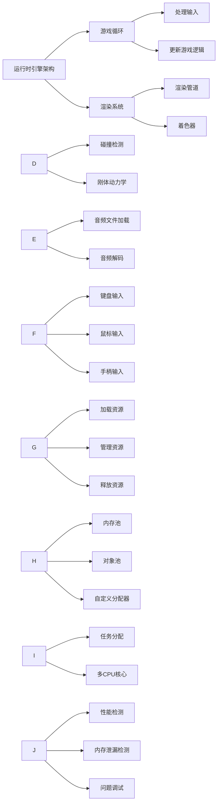

- 常用插件推荐
  - [[UniTask]](https://github.com/Cysharp/UniTask.git?path=src/UniTask/Assets/Plugins/UniTask)
- 文档
  - C#
    - [C#基础](Document/C#/C#基础.md)
    - [C#进阶_字典原理实现](Document/C#/C# 进阶/字典实现原理.md)
    - [C#进阶_结构体&类](Document/C#/C# 进阶/结构体&类.md)
    - [排序](Document/C#/排序.md)
    - [设计模式](Document/C#/设计模式.md)
    - [数据结构](Document/C#/数据结构.md)
    - [网络同步](Document/C#/网络同步.md)
  - Lua
    - [Lua](Document/Lua/Lua.md)
  - Unity
    - [基础_面试](Document/基础_面试.md)
    - [基础_优化](Document/基础_优化.md)
    - [进阶_TextMeshPro](Document/进阶_TextMeshPro.md)
    - [进阶_合批](Document/进阶_合批.md)
  - 数据库

