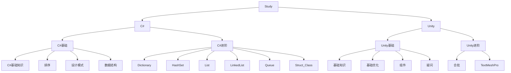

- C#
  - 基础
    - [C#基础基础](Document/C#/C#基础知识.md)
    - [排序](Document/C#/排序.md)
    - [设计模式](Document/C#/设计模式.md)
    - [数据结构](Document/C#/数据结构.md)
  - 进阶
    - [Dictionary](Document/C#/C#进阶/Dictionary.md)
    - [HashSet](Document/C#/C#进阶/HashSet.md)
    - [List](Document/C#/C#进阶/List.md)
    - [LinkedList](Document/C#/C#进阶/LinkedList.md)
    - [Queue](Document/C#/C#进阶/Queue.md)
    - [Struct&Class](Document/C#/C#进阶/Struct&Class.md)
    - [SharedMemory](Document/C#/C#进阶/SharedMemory.md)
- Unity
  - 基础
    - [基础知识](Document/Unity/Unity基础知识.md)
    - [基础优化](Document/Unity/Unity基础优化.md)
    - [Unity组件](Document/Unity/Unity组件.md)
    - [疑问](Document/Unity/疑问.md)
  - 进阶
    - [合批](Document/进阶/合批.md)
    - [TextMeshPro](Document/Unity/进阶/TextMeshPro.md)

